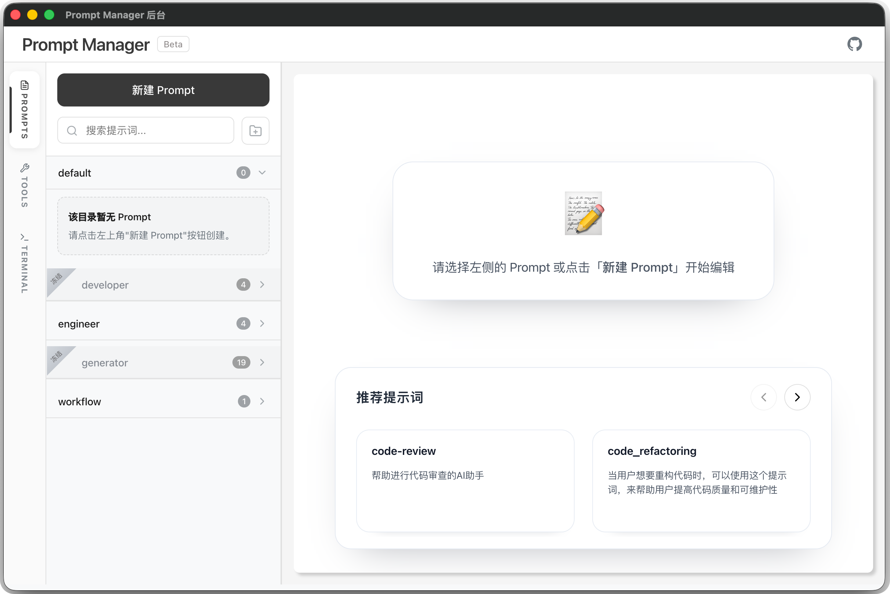
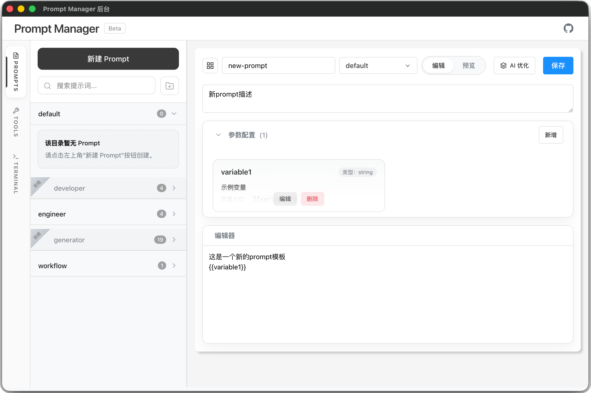
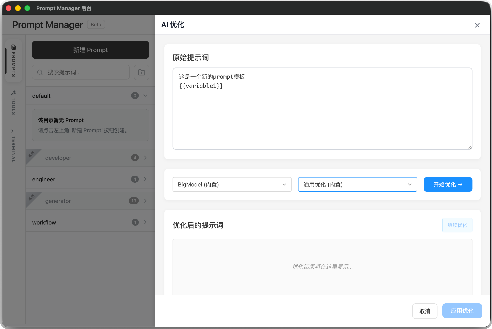
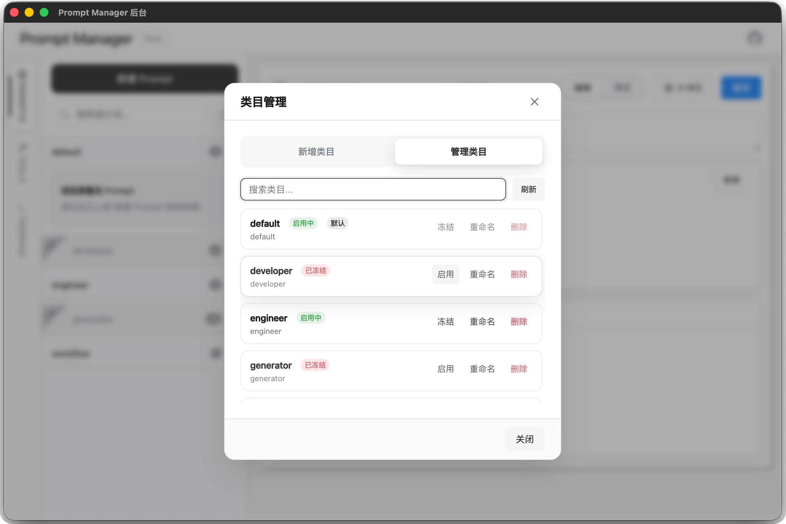
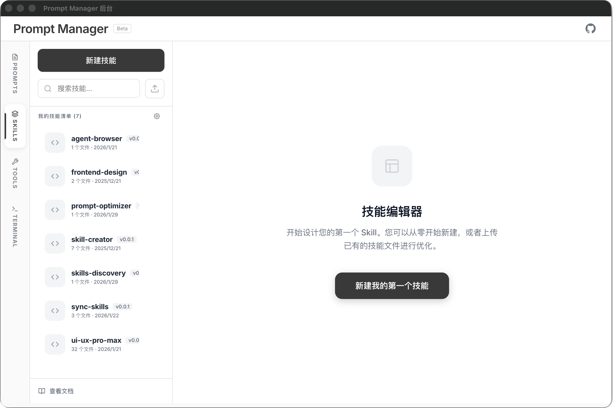
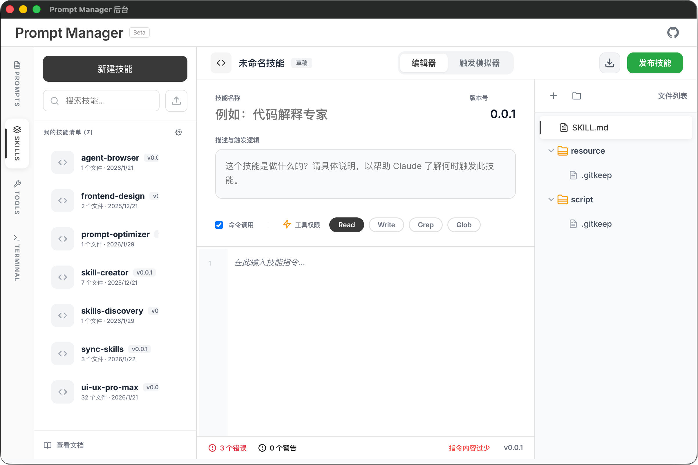
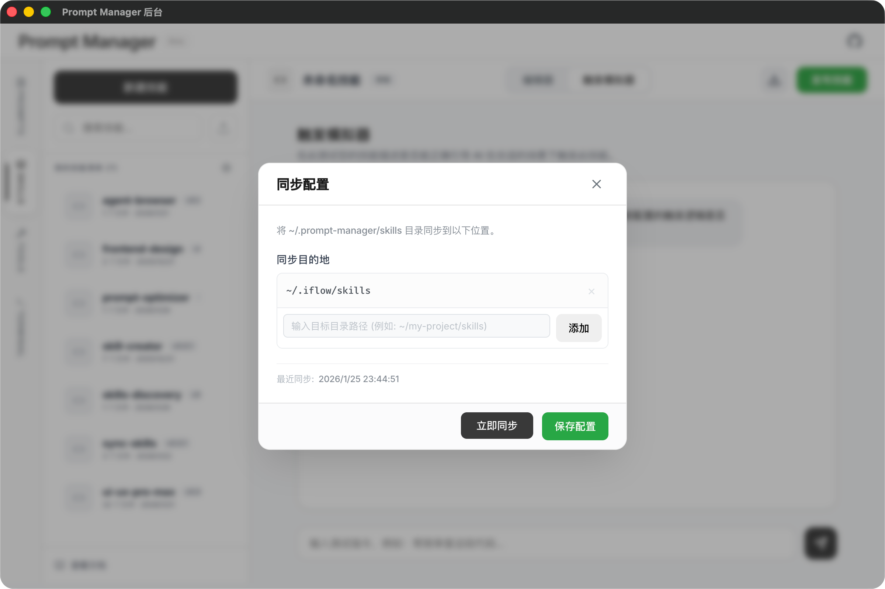
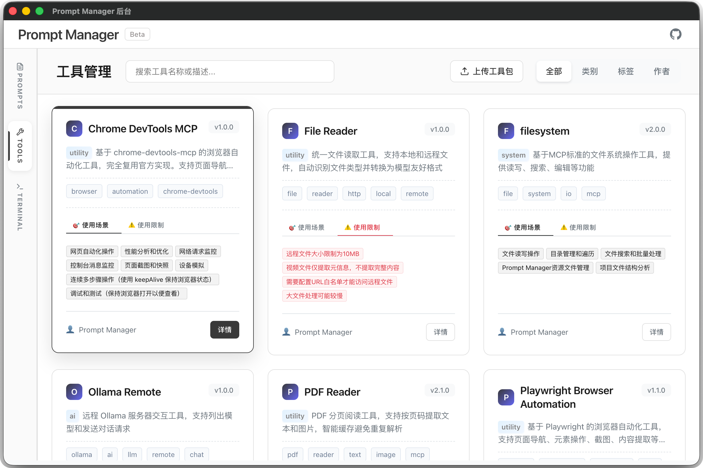
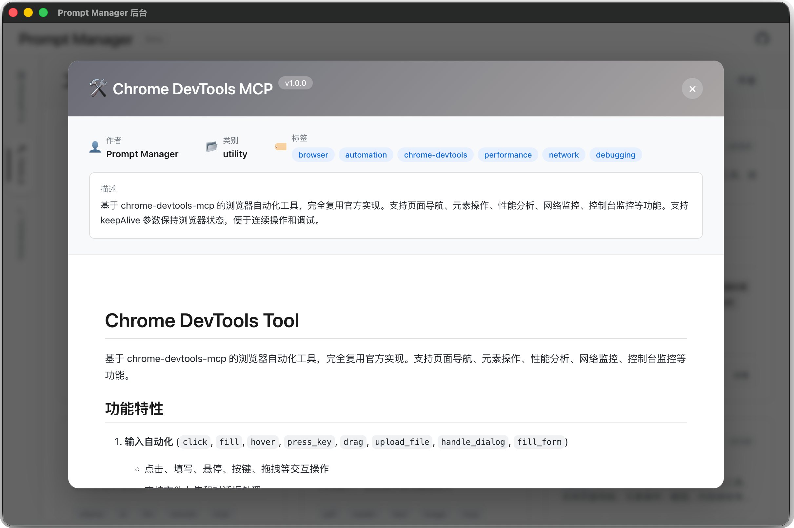

# Prompt Manager

[](https://www.npmjs.com/package/@becrafter/prompt-manager)
[](https://opensource.org/licenses/MIT)
[]()

> 🚀 **全栈 AI 能力管理平台** - 集成提示词管理、工具沙箱、技能同步、AI 优化的企业级 MCP 协议服务器

## ✨ 核心特性

### 🎯 提示词管理系统
- 📝 **模板化管理** - 将常用提示词保存为可复用的 YAML 模板
- 🔍 **智能搜索** - 支持关键词和语义搜索，快速定位所需提示词
- 📁 **分组组织** - 支持文件夹分组和元数据管理，便于分类维护
- 🔧 **参数化支持** - 支持变量替换（`{{变量名}}`），让提示词更灵活
- ✅ **启用/禁用控制** - 细粒度控制提示词的可用性

### 🤖 AI 增强功能
- ⚡ **AI 优化** - 使用 AI 自动优化提示词质量，支持多种模型（OpenAI、Google 等）
- 🔄 **迭代改进** - 支持多轮迭代优化，持续提升提示词效果
- 📊 **会话跟踪** - 跟踪优化过程中的迭代状态和历史记录
- 📡 **流式输出** - 支持 SSE 流式传输，实时获取优化结果

### 🛠️ 工具沙箱系统
- 🔒 **安全隔离** - 每个工具在独立沙箱环境中运行，互不干扰
- 📦 **依赖管理** - 每个工具独立管理依赖，自动安装和更新
- 🎯 **动态加载** - 支持运行时动态加载和卸载工具
- 📝 **日志隔离** - 每个工具有独立的日志文件，便于调试
- 🔌 **多模式执行** - 支持 manual、execute、configure、log 四种执行模式

### 🎓 技能管理系统
- 🏛️ **中心化存储** - 统一管理所有 AI 工具技能（Claude Skills、Cursor Rules 等）
- 🔄 **智能同步** - 一处修改，自动同步到多个工具目录（优先符号链接，降级复制）
- 📡 **实时监听** - 目录变更自动同步到所有目标，零延迟生效
- 📤 **导入导出** - 支持技能包打包分享，方便团队协作和迁移
- 🌐 **多目标支持** - 同时同步到 Cursor、Claude Code、VS Code 等多个工具

### 🔌 MCP 协议支持
- ✅ **完全兼容** - 实现完整的 Model Context Protocol 标准
- 🌊 **流式传输** - 基于 StreamableHTTP 协议优化，支持长连接和会话恢复
- 🔄 **会话管理** - 支持 10 分钟断线保持，自动恢复会话状态
- 📊 **动态描述** - 工具描述根据沙箱状态动态生成

### 🖥️ 终端集成
- 💻 **实时终端** - 集成 WebSocket 终端服务，支持命令执行和会话管理
- 🎨 **现代化 UI** - 基于 xterm.js 的终端界面，支持主题切换和快捷键
- 🔒 **安全控制** - 支持工作目录限制和环境变量配置

### 💻 多界面支持
- 🖥️ **桌面应用** - 开箱即用的 Electron 桌面应用，支持 macOS
- 🌐 **Web 管理** - 现代化的 Web 管理界面，支持实时编辑和预览
- 💻 **命令行** - 强大的 CLI 工具，支持脚本集成和自动化

### 🔌 开放生态
- 🌐 **REST API** - 提供完整的 REST API，支持程序化调用和集成
- 📦 **模块化设计** - 支持作为 npm 包使用，可嵌入到其他项目中
- 🔌 **插件扩展** - 支持自定义工具和技能扩展

## 🚀 快速开始

### 方式一：桌面应用（推荐）

```bash
# 1. 一键安装桌面应用
curl -fsSL http://iskill.site/scripts/installer/prompt-manager | bash

# 2. 下载并安装桌面应用
npm run desktop:build

# 3. 双击运行安装包
# 4. 点击系统托盘图标开始使用
```

**效果展示：**















### 方式二：命令行运行

#### 安装 CLI 工具

```bash
# 全局安装（推荐）
npm install -g @becrafter/prompt-manager

# 或本地安装
npm install @becrafter/prompt-manager
npx @becrafter/prompt-manager
```

#### 基本使用

```bash
# 启动服务（默认端口 5621）
prompt-manager

# 指定端口和提示词目录
prompt-manager --prompts-dir ./my-prompts --port 8080

# 查看帮助信息
prompt-manager --help
```

#### CLI 参数说明

```bash
# 核心参数
-p, --prompts-dir <目录>    指定 prompts 文件所在目录
-P, --port <端口>          指定服务器端口 (默认: 5621)
-h, --help                 显示帮助信息

# 示例
prompt-manager --prompts-dir ./examples/prompts
prompt-manager -p /path/to/prompts -P 3000
```

### 方式三：开发环境

```bash
# 克隆项目
git clone https://github.com/BeCrafter/prompt-manager.git
cd prompt-manager

# 安装依赖
npm install

# 启动开发服务器
npm run dev:all

# 访问管理界面
# http://localhost:5621/admin
```

## 🎨 使用场景

### 👥 团队协作
- **共享提示词库** - 团队成员共享高质量提示词模板
- **技能库统一** - 团队共享 AI 工具技能，避免配置不一致
- **标准化流程** - 统一团队的 AI 使用规范和最佳实践
- **知识传承** - 新成员快速上手，避免重复造轮子

### 🤖 AI 开发者
- **提示词优化** - 使用 AI 自动改进提示词效果
- **版本管理** - 跟踪提示词的演进历史
- **效果对比** - A/B 测试不同版本的提示词效果
- **工具集成** - 自定义工具扩展功能边界

### 🛠️ 程序集成
- **API 调用** - 通过 REST API 集成到现有系统中
- **MCP 协议** - 与支持 MCP 的 AI 客户端无缝集成
- **自动化流程** - 在 CI/CD 流程中自动调用提示词
- **多工具管理** - 统一管理 Cursor、Claude Code 等工具的技能

### 📚 知识管理
- **提示词库构建** - 构建组织级提示词知识库
- **技能资产管理** - 管理 AI 工具的技能资产
- **最佳实践沉淀** - 将最佳实践固化为可复用的技能

## 📋 核心功能概览

### 🎯 提示词管理
- 创建和编辑 YAML 格式的提示词模板
- 支持参数化变量替换（`{{变量名}}`）
- 文件夹分组和元数据管理
- 启用/禁用控制，分组继承机制
- 智能搜索和过滤功能

### 🤖 AI 优化服务
- 多模型支持（OpenAI、Google、Claude 等）
- SSE 流式优化输出，实时获取结果
- 三种优化模式：quick、deep、iterate
- 优化模板和模型管理
- 优化历史记录和迭代跟踪

### 🛠️ 工具沙箱系统
- 7+ 内置工具（文件操作、PDF 读取、浏览器自动化等）
- 独立沙箱环境，每个工具隔离运行
- 自动依赖管理（基于 @npmcli/arborist）
- 四种执行模式：manual、execute、configure、log
- 工具包上传和自定义工具开发

### 🎓 技能管理系统
- 统一管理 AI 工具技能（Claude Skills、Cursor Rules 等）
- 智能多目标同步（优先符号链接，降级文件复制）
- 实时目录监听，自动同步变更
- 技能包导入导出，支持团队协作
- Web 界面在线编辑技能

### 🔌 MCP 协议服务器
- 完整的 Model Context Protocol 实现
- StreamableHTTP 流式传输
- 10 分钟会话保持，支持断线重连
- 动态工具描述生成
- 提示词搜索和获取工具

### 🖥️ WebSocket 终端服务
- 实时终端会话管理
- 基于 xterm.js 的现代化终端 UI
- 支持主题切换（深色/浅色）
- 快捷键支持（Ctrl+C、Ctrl+V 等）
- 命令历史记录和搜索

### 💻 多界面支持
- Electron 桌面应用（macOS/Windows/Linux）
- Web 管理界面
- 命令行工具（CLI）
- 响应式设计，适配各种屏幕尺寸

### 🔌 开放 API
- 完整的 REST API（管理 API + 公开 API）
- 支持作为 npm 包集成
- 插件和技能扩展机制

#### 🛡️ 工具沙箱机制

Prompt Manager 采用创新的工具沙箱机制，确保工具安全可控：

**工作原理：**
1. **系统工具存储** - 内置工具位于 `packages/resources/tools/`
2. **沙箱环境同步** - 首次运行时自动复制到 `~/.prompt-manager/toolbox/`
3. **隔离执行** - 每个工具在独立沙箱目录中运行
4. **权限控制** - 自动生成 package.json 管理工具权限

**内置工具列表：**
- **filesystem** - 文件系统操作（读写文件、目录管理）
- **file-reader** - 高级文件读取（支持多种格式）
- **pdf-reader** - PDF 文档解析和内容提取
- **chrome-devtools** - 浏览器自动化和网页抓取
- **playwright** - 现代网页自动化测试
- **ollama-remote** - 本地 AI 模型集成
- **todolist** - 任务管理和待办事项

**自定义工具开发：**
```javascript
// 工具结构示例
export default {
  getMetadata() {
    return {
      name: 'my-tool',
      description: '我的自定义工具',
      version: '1.0.0'
    };
  },

  getSchema() {
    return {
      type: 'object',
      properties: {
        input: { type: 'string' }
      }
    };
  },

  async execute({ input }) {
    // 工具逻辑
    return { result: `处理结果: ${input}` };
  }
};
```

### 技能管理
- ✅ 中心化技能库 - 统一管理所有 AI 工具技能
- ✅ 多目标同步 - 一处修改，自动同步到多个工具目录
- ✅ 在线编辑 - Web 界面直接编辑技能
- ✅ 导入导出 - 支持技能包的分享和迁移

#### 🎯 技能同步机制

Prompt Manager 的技能管理系统解决了多 AI 工具环境下的"配置熵增"问题：

**核心特性：**
1. **统一存储** - 所有技能集中存储在 `~/.prompt-manager/skills/`
2. **智能同步** - 优先使用符号链接（零成本），自动降级到文件复制
3. **实时监听** - 目录变更自动同步到所有目标
4. **多目标支持** - 同时同步到 Cursor、Claude Code 等多个工具

**同步配置示例：**
```json
{
  "enabled": true,
  "targets": [
    "~/.cursor/rules",
    "~/.claude/skills",
    "~/projects/my-project/.opencode/skills"
  ]
}
```

**技能格式：**
```markdown
---
name: code-review
description: 代码审查助手
version: 1.0.0
allowedTools:
  - codebase-analyzer
  - git-diff
model: claude-3-5-sonnet
---

# 代码审查助手

这是一个专业的代码审查技能...
```

**使用场景：**
- **个人开发者** - 一处修改，多处生效
- **团队协作** - 团队共享技能库，自动同步
- **项目隔离** - 不同项目使用不同技能集

详细文档请参考：[技能管理系统开发文档](docs/dev/SKILL_MANAGEMENT.md)

### 界面体验
- ✅ 现代化 Web 界面，支持实时编辑和预览
- ✅ Electron 桌面应用，支持系统托盘管理
- ✅ 强大的 CLI 工具，支持脚本集成和自动化
- ✅ 响应式设计，适配各种屏幕尺寸和设备

## 🛠️ 环境要求

### 系统要求

#### 通用要求
- **Node.js**: v22.20.0+ (推荐使用 nvm 管理版本)
- **操作系统**: macOS, Windows, Linux
- **内存**: 至少 512MB 可用内存
- **磁盘空间**: 至少 200MB 可用空间（包含工具沙箱）

#### NPM 包使用要求
- **Node.js**: v22.20.0+ (必须版本)
- **网络**: 需要网络连接（用于 AI 模型调用）
- **权限**: 需要写权限创建用户配置目录
- **原生模块**: node-pty (会自动编译)

#### 开发环境额外要求
- **Git**: 用于代码管理
- **npm**: v8.0.0+ (随 Node.js 安装)
- **Python**: v3.7+ (用于原生模块编译)

### 环境检查

项目提供了便捷的环境检查脚本：

```bash
# 自动检查开发环境
npm run check:env

# 或手动检查
node --version  # 应显示 v22.x.x
npm --version   # 检查 npm 版本
```

### 常见问题

#### Node.js 版本问题
```bash
# 使用 nvm 切换版本
nvm install 22
nvm use 22

# 或从官网下载 v22.20.0
# https://nodejs.org/
```

#### 依赖编译问题
```bash
# 修复 node-pty 编译问题
npm run fix:pty
```

#### NPM 包使用问题

**Q: 安装后提示权限错误？**
```bash
# 使用管理员权限安装（macOS/Linux）
sudo npm install -g @becrafter/prompt-manager

# 或使用 nvm 管理的 Node.js
nvm use 22
npm install -g @becrafter/prompt-manager
```

**Q: 启动时报错 "node-pty module not available"？**
```bash
# 重新编译原生模块
npm rebuild node-pty

# 或在项目目录中运行
cd /usr/local/lib/node_modules/@becrafter/prompt-manager
npm rebuild node-pty
```

**Q: 如何查看工具沙箱目录？**
```bash
# 查看沙箱目录内容
ls -la ~/.prompt-manager/toolbox/

# 查看工具日志
ls -la ~/.prompt-manager/toolbox/*/logs/
```

## 📝 提示词格式

Prompt Manager 使用简洁的 YAML 格式定义提示词：

```yaml
name: code-review
description: 代码审查助手
messages:
  - role: user
    content:
      text: |
        请审查这段 {{language}} 代码：

        ```{{language}}
        {{code}}
        ```

        请指出潜在问题和改进建议
arguments:
  - name: language
    description: 编程语言
    type: string
    required: true
  - name: code
    description: 要审查的代码
    type: string
    required: true
enabled: true
```

### 参数支持
- **变量替换**: 使用 `{{变量名}}` 语法
- **类型支持**: string, number, boolean
- **可选参数**: 设置 `required: false`

### 分组管理
- **文件夹分组**: 将提示词放在子目录中自动分组
- **分组元数据**: 在 `.group.json` 中定义分组信息

## ⚙️ 配置和部署

### 命令行参数
```bash
prompt-manager --port 5621              # 指定端口
prompt-manager --prompts-dir ./prompts  # 指定提示词目录
```

### 环境变量
```env
SERVER_PORT=5621
ADMIN_USERNAME=admin
ADMIN_PASSWORD=your_password
LOG_LEVEL=info
```

### 存储位置
```
~/.prompt-manager/
├── prompts/           # 提示词目录
├── skills/            # 技能目录
├── toolbox/           # 工具沙箱
│   ├── filesystem/
│   ├── pdf-reader/
│   └── ...
├── configs/           # 配置目录
│   ├── models/
│   └── templates/
├── .env               # 环境变量配置
└── temp/              # 临时文件目录
```

- **提示词**: `~/.prompt-manager/prompts`
- **技能**: `~/.prompt-manager/skills`
- **工具沙箱**: `~/.prompt-manager/toolbox`
- **配置**: `~/.prompt-manager/.env`
- **日志**: `~/Library/Application Support/@becrafter/prompt-desktop/` (macOS) 或 `~/.config/@becrafter/prompt-desktop/` (Linux)

## 🔧 开发者指南

### 作为库使用
```javascript
import { startServer } from '@becrafter/prompt-manager-core';

await startServer({
  configOverrides: {
    promptsDir: './my-prompts',
    port: 3000
  }
});
```

### 开发环境
```bash
git clone https://github.com/BeCrafter/prompt-manager.git
cd prompt-manager
npm install
npm run dev:all  # 启动所有服务
```

## 📡 API 概览

### 管理 API (需要认证)
**提示词管理**
- `GET /adminapi/prompts` - 获取提示词列表（支持搜索/过滤）
- `POST /adminapi/prompts` - 创建/更新提示词
- `GET /adminapi/prompts/:name` - 获取单个提示词
- `DELETE /adminapi/prompts/:name` - 删除提示词

**AI 优化服务**
- `GET /adminapi/optimization/models` - 获取 AI 模型列表
- `POST /adminapi/prompts/optimize` - AI 优化提示词（SSE 流式输出）
- `POST /adminapi/prompts/optimize/iterate` - 迭代优化
- `GET/POST/PUT/DELETE /adminapi/optimization/templates` - 模板管理
- `GET/POST/PUT/DELETE /adminapi/optimization/models` - 模型管理

**技能管理**
- `GET /adminapi/skills` - 获取技能列表（支持搜索/过滤）
- `GET /adminapi/skills/:id` - 获取单个技能详情
- `POST /adminapi/skills` - 创建技能
- `PUT /adminapi/skills/:id` - 更新技能
- `DELETE /adminapi/skills/:id` - 删除技能
- `POST /adminapi/skills/:id/duplicate` - 复制技能
- `GET /adminapi/skills/:id/export` - 导出技能包
- `POST /adminapi/skills/upload` - 上传技能包
- `POST /adminapi/skills/validate` - 验证技能格式
- `POST /adminapi/skills/reload` - 重新加载技能

**技能同步**
- `GET /adminapi/skills/sync/config` - 获取同步配置
- `PUT /adminapi/skills/sync/config` - 更新同步配置
- `POST /adminapi/skills/sync/run` - 手动执行同步

**工具管理**
- `GET /tool/list` - 获取工具列表（支持搜索/过滤/分页）
- `GET /tool/detail/:toolName` - 获取工具详情
- `GET /tool/readme/:toolName` - 获取工具 README
- `POST /tool/upload` - 上传工具包（ZIP）

### 公开 API (无需认证)
- `GET /openapi/prompts` - 获取启用的提示词（支持相似度搜索）
- `POST /openapi/process` - 处理提示词（带参数替换）

### MCP 协议支持
- `prompts` - 提示词管理助手（搜索、获取）
- `toolm` - 工具管理系统（manual、execute、configure、log 四种模式）

---

## 📄 许可证

本项目采用 [MIT License](LICENSE) 开源协议。

---

## 🙏 致谢

感谢所有贡献者和用户，让这个项目变得更好！

特别感谢：
- [Model Context Protocol](https://modelcontextprotocol.io/) - 提供了统一的 AI 工具交互标准
- [Express.js](https://expressjs.com/) - 强大的 Web 框架
- [Electron](https://www.electronjs.org/) - 跨平台桌面应用框架

---

## 🔗 相关链接

- [官方网站](https://becrafter.github.io/prompt-manager/)
- [NPM 包](https://www.npmjs.com/package/@becrafter/prompt-manager)
- [GitHub 仓库](https://github.com/BeCrafter/prompt-manager)
- [问题反馈](https://github.com/BeCrafter/prompt-manager/issues)
- [功能讨论](https://github.com/BeCrafter/prompt-manager/discussions)

---

**Made with ❤️ by [BeCrafter Team](https://github.com/BeCrafter)**

⭐ 如果这个项目对你有帮助，请给我们一个 Star！
