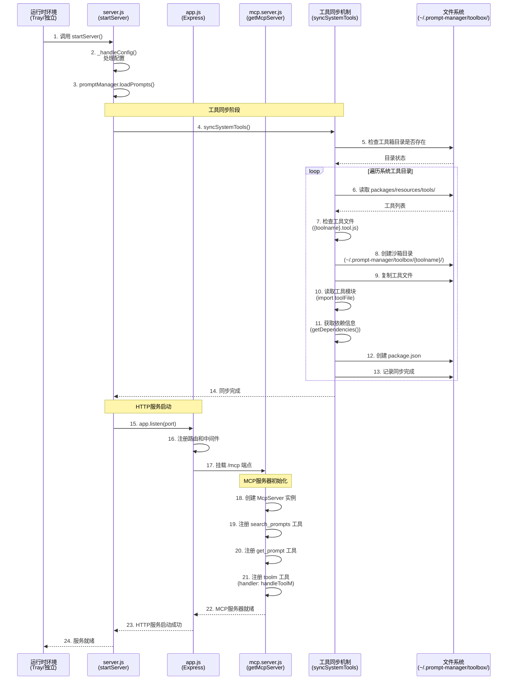
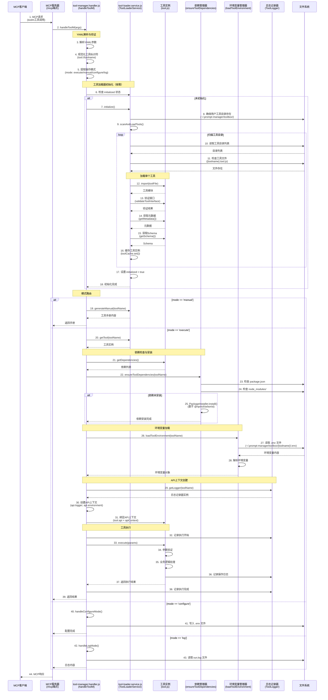
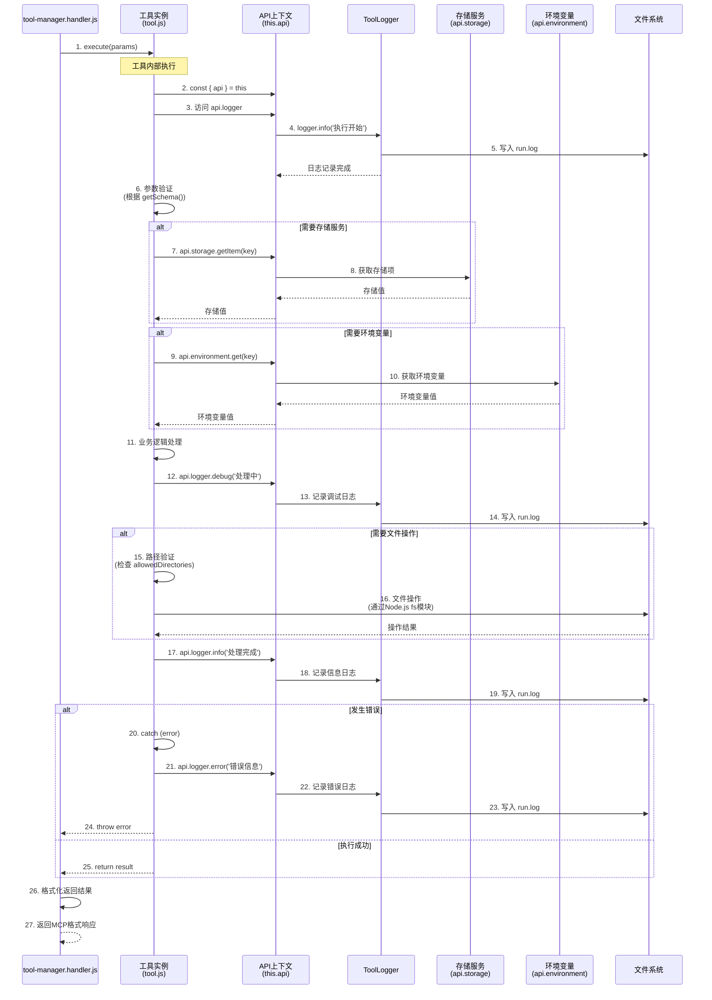
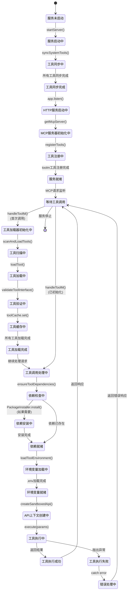
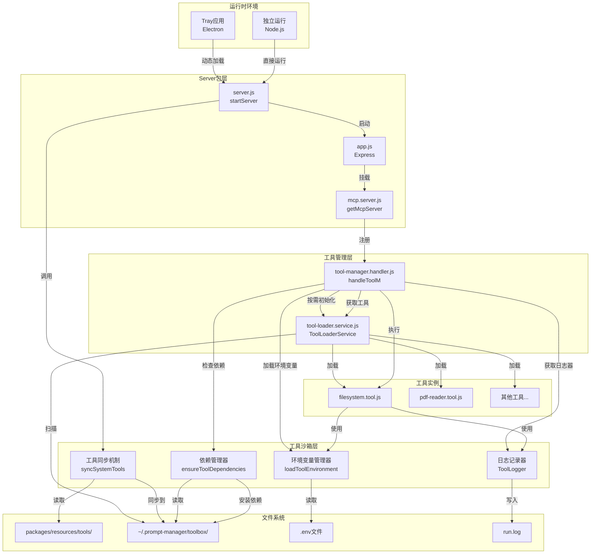

# Prompt Manager 工具独立沙箱环境设计方案

## 1. 背景与问题

当前 Prompt Manager 的工具机制存在以下问题：
- 工具依赖与项目环境混用，导致依赖冲突
- 工具无法独立管理自己的依赖版本
- 工具间可能产生依赖冲突
- 工具部署和更新不够灵活

## 2. 设计目标

- 每个工具拥有独立的运行沙箱环境
- 工具依赖自动安装和管理
- 工具运行环境隔离
- 向后兼容现有工具

## 3. 沙箱环境结构

### 3.1 目录结构变更
```
# 旧结构
~/.prompt-manager/tools/{toolname}/{toolname}.tool.js

# 新结构
~/.prompt-manager/toolbox/{toolname}/
├── {toolname}.tool.js        # 工具主文件
├── package.json              # 工具依赖配置
├── node_modules/             # 工具独立依赖
├── data/                     # 工具数据存储
├── logs/                     # 工具运行日志目录（预留）
└── run.log                   # 工具运行日志
```

### 3.2 系统内置工具目录
系统内置工具也需要在沙箱环境中运行。原有位于 `packages/resources/tools/` 目录下的工具需要同步到沙箱环境：

```
# 系统工具目录
packages/resources/tools/{toolname}/{toolname}.tool.js

# 同步到沙箱环境
~/.prompt-manager/toolbox/{toolname}/
├── {toolname}.tool.js       # 工具主文件
├── package.json             # 工具依赖配置
├── node_modules/            # 工具独立依赖
├── data/                    # 工具数据存储
├── logs/                    # 工具运行日志目录（预留）
└── run.log                  # 工具运行日志
```

### 3.3 工具同步与沙箱执行机制
所有工具（包括系统内置工具）都必须在沙箱环境中运行：

1. **系统工具同步**：服务启动时将 `packages/resources/tools/` 目录下的工具同步到 `~/.prompt-manager/toolbox/` 目录
2. **沙箱执行**：所有工具都通过沙箱执行器运行，确保隔离性
3. **依赖管理**：每个工具独立管理其依赖，无论是否为系统内置工具
4. **环境变量**：所有工具都支持通过 `.env` 文件配置环境变量
5. **日志记录**：所有工具的日志都输出到 `run.log` 文件中

**同步时机**：在 HTTP 服务启动时（`packages/server/server.js` 的 `startServer()` 函数），在服务启动流程中执行系统工具同步。

**运行时兼容性**：
- Server 包可运行在 Tray 应用（Electron）或独立 Node.js 环境中
- 工具同步逻辑必须兼容两种运行时场景
- 路径解析使用相对路径，避免硬编码绝对路径
- 资源文件访问需考虑 ASAR 打包场景（详见第 11.4 节）

```javascript
async function syncSystemTools() {
  const toolsDir = path.join(__dirname, '..', 'resources', 'tools');
  const toolboxDir = path.join(os.homedir(), '.prompt-manager', 'toolbox', toolName);
  
  if (!fs.existsSync(toolsDir)) {
    return;
  }
  
  const toolNames = fs.readdirSync(toolsDir);
  
  for (const toolName of toolNames) {
    const toolDir = path.join(toolsDir, toolName);
    const toolFile = path.join(toolDir, `${toolName}.tool.js`);
    
    if (fs.statSync(toolDir).isDirectory() && fs.existsSync(toolFile)) {
      // 同步到 toolbox 目录
      const sandboxDir = path.join(toolboxDir, toolName);
      const sandboxToolFile = path.join(sandboxDir, `${toolName}.tool.js`);
      
      // 创建沙箱目录
      await fs.promises.mkdir(sandboxDir, { recursive: true });
      
      // 复制工具文件
      await fs.promises.copyFile(toolFile, sandboxToolFile);
      
      // 创建或更新 package.json（如果不存在则创建，存在则更新依赖）
      const packageJsonPath = path.join(sandboxDir, 'package.json');
      let packageJson = {};
      
      if (await pathExists(packageJsonPath)) {
        // 读取现有的 package.json
        try {
          packageJson = await fs.readJson(packageJsonPath);
        } catch (error) {
          logger.warn(`读取 package.json 失败，将重新创建: ${packageJsonPath}`);
        }
      }
      
      // 读取工具模块获取依赖信息
      let dependencies = {};
      try {
        const toolModule = await import(toolFile);
        if (toolModule.default && typeof toolModule.default.getDependencies === 'function') {
          dependencies = toolModule.default.getDependencies() || {};
        }
      } catch (error) {
        logger.warn(`读取工具依赖失败: ${toolName}`, { error: error.message });
      }
      
      // 更新 package.json（合并现有依赖和新依赖）
      packageJson = {
        name: `@prompt-manager/${toolName}`,
        version: packageJson.version || '1.0.0',
        description: packageJson.description || `Prompt Manager System Tool: ${toolName}`,
        main: `${toolName}.tool.js`,
        type: 'module',
        dependencies: {
          ...(packageJson.dependencies || {}),
          ...dependencies
        },
        private: true
      };
      
      // 写入 package.json
      await fs.writeJson(packageJsonPath, packageJson, { spaces: 2 });
      
      console.log(`系统工具 ${toolName} 已同步到沙箱环境`);
    }
  }
}
```

## 4. 工具接口扩展

### 4.1 getDependencies() 方法扩展
```javascript
getDependencies() {
  return {
    // 工具的 npm 依赖
    'pdf-parse': '^1.1.1',
    'puppeteer': '^19.0.0',
    // 本地文件依赖（相对于工具目录）
    './local-module.js': 'local',
    // 系统命令依赖
    'docker': '>=20.0.0'
  };
}
```

### 4.2 新增 getRuntimeConfig() 方法
```javascript
getRuntimeConfig() {
  return {
    // 沙箱类型：nodejs, python, docker 等
    sandboxType: 'nodejs',
    // 最大内存限制 (MB)
    maxMemory: 512,
    // 最大执行时间 (秒)
    maxExecutionTime: 30,
    // 允许的文件系统访问路径
    allowedDirectories: [
      '~/.prompt-manager/toolbox/{toolname}/data',
      '~/.prompt-manager/shared'
    ],
    // 网络访问权限
    networkAccess: true,
    // 环境变量
    environment: {
      NODE_ENV: 'production'
    }
  };
}
```

## 5. 依赖管理机制

### 5.1 依赖检查与安装流程
```javascript
async function ensureToolDependencies(toolName) {
  const toolDir = path.join(os.homedir(), '.prompt-manager', 'toolbox', toolName);
  const packageJsonPath = path.join(toolDir, 'package.json');
  
  // 检查 package.json 是否存在
  if (!fs.existsSync(packageJsonPath)) {
    throw new Error(`工具 ${toolName} 缺少 package.json 文件`);
  }
  
  const packageJson = JSON.parse(fs.readFileSync(packageJsonPath, 'utf-8'));
  const nodeModulesPath = path.join(toolDir, 'node_modules');
  
  // 检查 node_modules 是否存在或是否需要更新
  if (!fs.existsSync(nodeModulesPath)) {
    await installDependencies(toolDir);
  } else {
    // 检查依赖版本是否匹配
    const installedPackageJson = await getInstalledDependencies(nodeModulesPath);
    if (!dependenciesMatch(packageJson.dependencies, installedPackageJson)) {
      await updateDependencies(toolDir);
    }
  }
}

async function installDependencies(toolDir, dependencies) {
  // 使用 PackageInstaller 安装依赖（基于 @npmcli/arborist）
  // PackageInstaller 不依赖系统 npm，可在 Electron 环境中直接使用
  const result = await PackageInstaller.install({
    workingDir: toolDir,
    dependencies: dependencies,
    timeout: 300000 // 5分钟超时
  });
  
  logger.info('依赖安装成功', {
    elapsed: result.elapsed,
    installedCount: result.installedPackages.length
  });
  
  return result;
}
```

### 5.2 依赖安装实现

**实际实现：使用 PackageInstaller 基于 @npmcli/arborist**

工具依赖安装使用 `PackageInstaller` 服务，该服务基于 `@npmcli/arborist` 实现，不依赖系统 npm 命令。这使得依赖安装可以在 Electron 环境中直接使用，无需系统安装 npm。

**实现位置**：`packages/server/toolm/package-installer.service.js`

**关键特性**：
- 不依赖系统 npm 命令
- 可在 Electron 环境中直接使用
- 支持自动选择最优的 npm registry
- 支持超时控制（默认 5 分钟）

**依赖安装流程**：
1. 检查 `package.json` 是否存在，如果不存在则自动创建
2. 检查 `node_modules` 目录是否存在
3. 检查依赖是否需要更新（通过 `PackageInstaller.isPackageInstalled()` 检查）
4. 如果需要安装或更新，调用 `PackageInstaller.install()` 安装依赖

### 5.3 依赖版本锁定
每个工具的 `package.json` 应包含精确的依赖版本，推荐使用 `package-lock.json` 锁定版本。

## 6. 沙箱执行机制

### 6.0 实际实现说明

**实际实现：ES6 模块 + 受限执行环境**

设计文档中提到的 VM 执行方案是理想方案，但实际实现采用了 ES6 模块 + 受限执行环境方案。

**实现方式：**
- 工具使用 ES6 模块格式开发
- 通过动态 `import()` 加载工具模块
- 通过上下文绑定和 API 层限制实现安全隔离

**安全措施：**
- 上下文绑定（this.api）- 工具只能通过受限 API 访问资源
- 超时控制 - 防止工具无限执行
- API 层限制 - 所有操作通过受限 API
- 路径验证 - 防止越权访问
- 日志隔离 - 每个工具有独立日志
- 依赖隔离 - 每个工具有独立的 node_modules

**适用场景：**
- ✅ 系统内置工具（信任度高）
- ✅ 用户自己开发的工具（用户负责安全）
- ⚠️ 第三方不可信工具（未来可能需要 VM 完全隔离）

**选择原因：**
1. ES6 语法开发体验更好
2. 避免 ES6 转 CommonJS 的转换风险
3. 对于系统工具和用户工具，当前方案已足够安全
4. 节省开发时间

详细说明请参考 `TOOL_DEVELOPMENT_GUIDE.md`。

---

### 6.1 工具执行器（设计文档方案 - 未采用）

**注意**：设计文档中提到的 VM 执行方案是理想方案，但实际实现采用了更简单的 ES6 模块 + 受限执行环境方案（见 6.0 节）。

VM 方案的优点是完全隔离，但实现复杂。当前 ES6 模块方案对于系统工具和用户工具已足够安全，且开发体验更好。

### 6.2 环境变量配置机制
工具现在支持通过 `.env` 文件配置环境变量，该文件位于工具沙箱目录中。

#### 6.2.1 .env 文件格式
```
# Tool Environment Variables
# Tool: {toolname}
# Generated by PromptManager ToolEnvironment
# Last modified: 2025-11-18T02:00:08.104Z # 这里在实现时需要注意时区

ALLOWED_DIRECTORIES=/Users/mark
API_KEY=your-api-key
CUSTOM_VAR=value
```

文件位置：`~/.prompt-manager/toolbox/{toolname}/.env`

#### 6.2.2 环境变量加载机制
```javascript
async function loadToolEnvironment(toolName) {
  const toolDir = path.join(os.homedir(), '.prompt-manager', 'toolbox', toolName);
  const envFilePath = path.join(toolDir, '.env');
  
  // 检查 .env 文件是否存在
  if (!fs.existsSync(envFilePath)) {
    return {}; // 如果不存在则返回空对象
  }
  
  try {
    // 读取 .env 文件内容
    const envContent = fs.readFileSync(envFilePath, 'utf-8');
    
    // 解析 .env 文件内容
    const envVars = {};
    const lines = envContent.split('\n');
    
    for (const line of lines) {
      // 跳过注释和空行
      if (line.trim() === '' || line.startsWith('#')) {
        continue;
      }
      
      // 解析键值对
      const [key, ...valueParts] = line.split('=');
      if (key && valueParts.length > 0) {
        // 重新连接值部分（因为值中可能包含等号）
        let value = valueParts.join('=').trim();
        
        // 处理带引号的值
        if ((value.startsWith('"') && value.endsWith('"')) || 
            (value.startsWith("'") && value.endsWith("'"))) {
          value = value.substring(1, value.length - 1);
        }
        
        envVars[key.trim()] = value;
      }
    }
    
    return envVars;
  } catch (error) {
    console.error(`加载工具 ${toolName} 的环境变量失败:`, error.message);
    return {};
  }
}
```

#### 6.2.3 工具执行时的环境变量集成
```javascript
class ToolSandboxExecutor {
  async execute(toolName, params) {
    // 1. 确保依赖已安装
    await ensureToolDependencies(toolName);
    
    // 2. 加载工具环境变量
    const toolEnvVars = await loadToolEnvironment(toolName);
    
    // 3. 创建沙箱环境，合并环境变量
    const toolDir = path.join(os.homedir(), '.prompt-manager', 'toolbox', toolName);
    const toolModulePath = path.join(toolDir, `{toolName}.tool.js`);
    
    // 4. 创建工具 API 接口，限制权限
    const toolApi = this.createSandboxedApi(toolName, params);
    
    // 5. 在 Node.js 沙箱中执行工具，传递环境变量
    const { runInNewContext } = require('vm');
    const fs = require('fs');
    const path = require('path');
    
    // 读取工具代码
    const toolCode = fs.readFileSync(toolModulePath, 'utf-8');
    
    // 定义沙箱上下文，包含环境变量
    const sandbox = {
      // Node.js 内置模块（受限）
      require: this.createSandboxedRequire(toolDir),
      console: console,
      setTimeout: setTimeout,
      clearTimeout: clearTimeout,
      setInterval: setInterval,
      clearInterval: clearInterval,
      Buffer: Buffer,
      // 工具 API
      api: toolApi,
      params: params,
      // 工具上下文
      __toolDir: toolDir,
      __toolName: toolName,
      // 环境变量
      process: {
        env: {
          ...process.env,  // 继承主进程环境变量
          ...toolEnvVars   // 合并工具特定环境变量
        }
      }
    };
    
    try {
      // 执行工具代码
      const result = runInNewContext(`
        const module = { exports: {} };
        (function(exports, require, module, __filename, __dirname, api, params, process) {
          ${toolCode}
          return module.exports;
        })(module.exports, require, module, __filename, __dirname, api, params, process);
        module.exports.execute(params);
      `, sandbox, {
        filename: toolModulePath,
        timeout: this.getRuntimeConfig(toolName).maxExecutionTime * 1000
      });
      
      return result;
    } catch (error) {
      throw new Error(`工具执行失败: ${error.message}`);
    }
  }
}
```

#### 6.2.4 configure 模式实现

当使用 configure 模式时，工具框架会在工具目录内创建或更新 `.env` 文件，格式如下：

```
# Tool Environment Variables
# Tool: {toolname}
# Generated by PromptManager ToolEnvironment
# Last modified: {timestamp} # 这里的时间需要注意时区

KEY1=value1
KEY2=value2
```

文件位置：`~/.prompt-manager/toolbox/{toolname}/.env`

实现逻辑：解析配置参数 → 生成 .env 文件内容 → 写入文件 → 返回成功信息

### 6.3 日志记录机制
所有工具的输入和输出日志都应输出到 `~/.prompt-manager/toolbox/{toolname}/run.log` 文件中。

#### 6.3.1 日志文件格式
日志文件采用标准的结构化格式，包含时间戳、日志级别和消息内容：

```
[2025-11-18T02:00:08.104Z] [INFO] 执行开始 - 工具: pdf-reader, 参数: {"pdfPath":"/path/to/doc.pdf"}
[2025-11-18T02:00:08.150Z] [DEBUG] 加载 PDF 文件: /path/to/doc.pdf
[2025-11-18T02:00:09.200Z] [INFO] PDF 加载成功 - 页数: 15
[2025-11-18T02:00:10.300Z] [INFO] 执行完成 - 结果大小: 125KB
[2025-11-18T02:00:10.305Z] [ERROR] 文件处理失败 - 错误: 无法解析加密的PDF
```

文件位置：`~/.prompt-manager/toolbox/{toolname}/run.log`

#### 6.3.2 日志记录实现

日志记录器核心功能：
- **日志队列**：缓冲日志条目，批量写入提高性能
- **自动清理**：过滤超过3小时的旧日志
- **大小限制**：当日志文件超过10MB时，保留最新1000行
- **定期清理**：每小时运行一次全局日志清理任务

日志记录器通过 `api.logger` 暴露给工具，`console` 输出也会自动重定向到日志文件。

#### 6.3.3 沙箱中的日志集成

在工具执行时，`console.log`、`console.error` 等输出会自动重定向到工具的 `run.log` 文件。日志记录器在工具执行前后记录开始和完成信息，捕获执行异常并记录错误日志。

#### 6.3.4 日志清理机制
为了确保日志文件不会占用过多磁盘空间，系统提供了自动清理机制：

1. **基于时间的清理**：每个工具的日志记录器会自动清理超过3小时的旧日志
2. **基于大小的清理**：当日志文件超过10MB时，保留最新的1000行
3. **定期清理任务**：系统每小时运行一次全局日志清理，检查并清理所有工具的过期日志

通过这些机制，确保日志系统既能够保留足够的调试信息，又不会占用过多磁盘空间。

### 6.4 Python 工具沙箱（可选，未来扩展）

对于 Python 工具，可以使用类似的沙箱机制：
- 通过子进程执行 Python 脚本
- 独立的 `requirements.txt` 和虚拟环境
- 环境变量和日志记录机制与 Node.js 工具一致

当前版本仅支持 Node.js 工具，Python 工具支持为未来扩展功能。

## 7. 工具加载器更新

### 7.1 工具发现机制

工具加载器 (`ToolLoaderService`) 自动扫描以下目录：
- **所有工具**：`~/.prompt-manager/toolbox/`（系统工具和用户工具都在这里）

**注意**：系统内置工具在服务启动时已通过 `syncSystemTools()` 同步到 `~/.prompt-manager/toolbox/`，因此工具加载器只需要扫描这一个目录。

扫描规则：
1. 每个工具在独立的子目录中
2. 工具主文件名：`{tool-name}.tool.js`
3. 工具必须导出 ES6 模块的 default 对象
4. 工具必须实现 `execute` 方法

详见 `packages/server/toolm/tool-loader.service.js` 实现。

## 8. 工具安装与管理

### 8.1 工具安装流程

1. 创建工具目录：`~/.prompt-manager/toolbox/{tool-name}/`
2. 下载/复制工具文件到目录
3. 验证工具结构（必需文件、接口方法）
4. 自动安装依赖（使用 `PackageInstaller` 基于 `@npmcli/arborist`，不依赖系统 npm）
5. 工具就绪，可被加载和执行

### 8.2 工具更新流程

1. 备份当前版本
2. 更新工具文件
3. 重新安装依赖
4. 验证更新后的工具功能
5. 更新成功则删除备份，失败则回滚

**注意**：当前版本工具安装和更新功能为预留，具体实现待开发。

## 9. 安全机制

### 9.1 权限控制
- 文件系统访问限制在允许的目录内
- 网络访问可配置控制
- 系统命令执行限制
- 内存和执行时间限制

### 9.2 沙箱隔离
- 每个工具在独立的 Node.js VM 上下文中运行
- 工具间无法直接访问彼此的数据
- 工具无法访问系统敏感信息

## 10. 向后兼容性

### 10.1 迁移路径
```javascript
async function createSandboxStructure(oldToolDir, newToolDir) {
  // 创建新目录结构
  await fs.promises.mkdir(newToolDir, { recursive: true });
  await fs.promises.mkdir(path.join(newToolDir, 'data'), { recursive: true });
  await fs.promises.mkdir(path.join(newToolDir, 'logs'), { recursive: true });
  
  // 复制工具文件
  const toolFiles = await fs.promises.readdir(oldToolDir);
  for (const file of toolFiles) {
    if (file.endsWith('.js')) {
      await fs.promises.copyFile(
        path.join(oldToolDir, file),
        path.join(newToolDir, 'tool.js')
      );
    }
  }
  
  // 创建默认 package.json
  const packageJson = {
    name: path.basename(newToolDir),
    version: '1.0.0',
    description: 'Prompt Manager Tool',
    main: 'tool.js',
    dependencies: {},
    private: true
  };
  
  await fs.promises.writeFile(
    path.join(newToolDir, 'package.json'),
    JSON.stringify(packageJson, null, 2)
  );
}
```

## 11. 工具系统架构与流程

### 11.1 系统架构图

```
┌─────────────────────────────────────────────────────────────────┐
│                        运行时环境层                               │
├─────────────────────────────────────────────────────────────────┤
│  ┌──────────────┐                    ┌──────────────┐          │
│  │  Tray应用    │                    │  独立运行     │          │
│  │ (Electron)   │                    │  (Node.js)    │          │
│  └──────┬───────┘                    └──────┬───────┘          │
│         │                                    │                  │
│         └──────────────┬─────────────────────┘                  │
│                        │                                        │
│                        ▼                                        │
│              ┌─────────────────────┐                            │
│              │  ModuleLoader       │                            │
│              │  (动态加载server包)  │                            │
│              └──────────┬──────────┘                            │
└─────────────────────────┼──────────────────────────────────────┘
                          │
                          ▼
┌─────────────────────────────────────────────────────────────────┐
│                      Server包层 (packages/server)                │
├─────────────────────────────────────────────────────────────────┤
│                                                                 │
│  ┌──────────────────────────────────────────────────────────┐  │
│  │              server.js (startServer)                     │  │
│  │  • 配置处理 (_handleConfig)                              │  │
│  │  • 工具同步 (syncSystemTools) ← 新增                     │  │
│  │  • HTTP服务启动                                           │  │
│  └──────────────┬───────────────────────────────────────────┘  │
│                 │                                               │
│                 ▼                                               │
│  ┌──────────────────────────────────────────────────────────┐  │
│  │              app.js (Express应用)                         │  │
│  │  • 路由注册                                               │  │
│  │  • MCP端点 (/mcp)                                         │  │
│  └──────────────┬───────────────────────────────────────────┘  │
│                 │                                               │
│                 ▼                                               │
│  ┌──────────────────────────────────────────────────────────┐  │
│  │         mcp.server.js (getMcpServer)                     │  │
│  │  • 创建MCP服务器实例                                       │  │
│  │  • 注册工具: search_prompts, get_prompt, toolm           │  │
│  └──────────────┬───────────────────────────────────────────┘  │
└─────────────────┼──────────────────────────────────────────────┘
                  │
                  ▼
┌─────────────────────────────────────────────────────────────────┐
│                      工具管理层 (toolm)                          │
├─────────────────────────────────────────────────────────────────┤
│                                                                 │
│  ┌──────────────────────────────────────────────────────────┐  │
│  │      tool-manager.handler.js (handleToolM)               │  │
│  │  • YAML解析                                               │  │
│  │  • 模式路由 (manual/execute/configure/log)               │  │
│  │  • 工具调用                                               │  │
│  └──────────────┬───────────────────────────────────────────┘  │
│                 │                                               │
│                 ▼                                               │
│  ┌──────────────────────────────────────────────────────────┐  │
│  │    tool-loader.service.js (ToolLoaderService)            │  │
│  │  • 工具扫描 (scanAndLoadTools)                           │  │
│  │  • 工具加载 (loadTool)                                   │  │
│  │  • 接口验证 (validateToolInterface)                      │  │
│  │  • 工具缓存 (toolCache)                                   │  │
│  └──────────────┬───────────────────────────────────────────┘  │
└─────────────────┼──────────────────────────────────────────────┘
                  │
                  ▼
┌─────────────────────────────────────────────────────────────────┐
│                      工具沙箱层                                  │
├─────────────────────────────────────────────────────────────────┤
│                                                                 │
│  ┌──────────────────────────────────────────────────────────┐  │
│  │  工具同步机制 (syncSystemTools)                           │  │
│  │  • 从 packages/resources/tools/ 同步                      │  │
│  │  • 到 ~/.prompt-manager/toolbox/                          │  │
│  │  • 创建 package.json                                      │  │
│  └──────────────┬───────────────────────────────────────────┘  │
│                 │                                               │
│                 ▼                                               │
│  ┌──────────────────────────────────────────────────────────┐  │
│  │  工具执行环境                                              │  │
│  │  • 依赖管理 (ensureToolDependencies)                      │  │
│  │  • 环境变量加载 (loadToolEnvironment)                      │  │
│  │  • API上下文创建 (createSandboxedApi)                      │  │
│  │  • 日志记录器 (ToolLogger)                                 │  │
│  └──────────────┬───────────────────────────────────────────┘  │
│                 │                                               │
│                 ▼                                               │
│  ┌──────────────────────────────────────────────────────────┐  │
│  │  工具实例 (tool.js)                                        │  │
│  │  • getDependencies()                                      │  │
│  │  • getMetadata()                                          │  │
│  │  • getSchema()                                            │  │
│  │  • execute(params)                                        │  │
│  └──────────────────────────────────────────────────────────┘  │
└─────────────────────────────────────────────────────────────────┘
```

### 11.2 完整时序图

#### 11.2.1 服务启动与工具注册时序图



#### 11.2.2 工具加载与执行时序图



#### 11.2.3 工具执行详细流程时序图



### 11.3 数据流图

```
┌─────────────────────────────────────────────────────────────────┐
│                        数据流向图                                 │
└─────────────────────────────────────────────────────────────────┘

【工具文件流】
packages/resources/tools/{toolname}/{toolname}.tool.js
  │ (服务启动时同步)
  ▼
~/.prompt-manager/toolbox/{toolname}/{toolname}.tool.js
  │ (工具加载时)
  ▼
ToolLoaderService.toolCache (内存缓存)
  │ (工具调用时)
  ▼
工具实例执行

【依赖流】
工具模块 getDependencies()
  │
  ▼
package.json (工具目录)
  │
  ▼
PackageInstaller.install() (自动安装，基于 @npmcli/arborist)
  │
  ▼
node_modules/ (工具独立依赖)

【环境变量流】
configure 模式参数
  │
  ▼
.env 文件 (~/.prompt-manager/toolbox/{toolname}/.env)
  │ (工具执行时加载)
  ▼
api.environment (工具API上下文)
  │
  ▼
工具执行环境

【日志流】
工具执行过程
  │
  ▼
api.logger (日志记录器)
  │
  ▼
run.log (~/.prompt-manager/toolbox/{toolname}/run.log)
  │ (自动清理超过3小时的日志)
  ▼
日志文件维护
```

### 11.4 状态转换图



### 11.5 架构说明

**重要：运行时环境兼容性**

`packages/server` 包被设计为可在多种运行时环境中使用：

1. **Tray 应用运行时**（主要场景）
   - Tray 应用（`app/desktop`）通过 `ModuleLoader` 动态加载 `packages/server` 包
   - Server 包运行在 Tray 应用的 Node.js 运行时中
   - 资源路径需要考虑 Electron ASAR 打包场景

2. **独立运行时**（开发/CLI场景）
   - 直接运行 `packages/server/server.js`
   - 通过 CLI 命令启动（`app/cli/commands/start.js`）
   - 标准 Node.js 运行时环境

**实现注意事项**：
- 工具同步机制必须兼容两种运行时环境
- 路径解析需要考虑 ASAR 打包场景（使用 `util.getWebUiRoot()` 等工具函数）
- 资源文件访问需要使用兼容的方式（支持 ASAR 和普通文件系统）
- 避免硬编码路径，使用相对路径和工具函数解析

### 11.6 集成点

沙箱工具机制在 HTTP 服务中的集成点：

1. **服务启动阶段** (`packages/server/server.js`)
   - `startServer()` - HTTP 服务启动入口
   - 在服务启动流程中执行系统工具同步（从 `packages/resources/tools/` 同步到 `~/.prompt-manager/toolbox/`）
   - 初始化工具加载器（可选：在服务启动时预加载，或按需加载）
   - **注意**：工具同步逻辑需要兼容 Tray 应用和独立运行两种场景

2. **工具加载器初始化** (`packages/server/toolm/tool-loader.service.js`)
   - `ToolLoaderService.initialize()` - 扫描并加载工具
   - 自动从 `~/.prompt-manager/toolbox/` 加载工具（系统工具和用户工具都在这里）
   - 当前实现：按需初始化（首次调用 `handleToolM()` 时初始化）
   - **注意**：工具目录路径解析需要考虑运行时环境的差异

3. **工具执行** (`packages/server/toolm/tool-manager.handler.js`)
   - `handleToolM()` - 处理工具调用请求
   - 通过 MCP 协议暴露工具能力（`packages/server/mcp/mcp.server.js`）

### 11.7 组件交互图



### 11.8 关键组件说明

#### 11.8.1 工具同步机制 (syncSystemTools)

**职责**：
- 在服务启动时，将系统内置工具从 `packages/resources/tools/` 同步到 `~/.prompt-manager/toolbox/`
- 为每个工具创建独立的沙箱目录结构
- 生成 `package.json` 文件（如果不存在）

**执行时机**：
- HTTP 服务启动时（`server.js` 的 `startServer()` 函数中）
- 在 MCP 服务器初始化之前执行

**关键步骤**：
1. 扫描 `packages/resources/tools/` 目录
2. 对每个工具目录：
   - 创建目标沙箱目录 `~/.prompt-manager/toolbox/{toolname}/`
   - 复制工具文件 `{toolname}.tool.js`
   - 读取工具模块获取依赖信息
   - 生成 `package.json` 文件
3. 记录同步结果

#### 11.8.2 工具加载器 (ToolLoaderService)

**职责**：
- 扫描并加载所有可用工具（系统工具和用户工具）
- 验证工具接口完整性
- 缓存工具实例和元数据
- 提供工具查询和管理接口
- 生成格式化的工具手册（Manual 模式）

**初始化时机**：
- 按需初始化：首次调用 `handleToolM()` 时
- 可选：在服务启动时预初始化

**关键方法**：
- `initialize()` - 初始化工具加载器
- `scanAndLoadTools()` - 扫描工具目录
- `loadTool(toolName, toolFile)` - 加载单个工具
- `validateToolInterface()` - 验证工具接口
- `getTool(toolName)` - 获取工具实例
- `getAllTools()` - 获取所有工具列表
- `generateManual(toolName)` - 生成格式化的工具手册

**generateManual() 输出内容**：
- 工具元数据（metadata）：名称、版本、作者、描述、标签
- 使用场景列表
- 参数说明（schema.parameters）：参数名称、类型、是否必需、描述、默认值、可选值
- 环境变量定义（schema.environment）：变量名称、说明、默认值
- 常见错误处理（businessErrors）：错误代码、描述、解决方案、是否可重试
- 限制说明（limitations）
- 使用示例（代码示例）

**输出格式**：
- 使用 Markdown 格式
- 清晰的标题层级结构
- 重要信息使用粗体标记
- 代码示例使用代码块
- 列表和表格格式化展示

#### 11.8.3 工具管理器 (tool-manager.handler.js)

**职责**：
- 处理 MCP 工具调用请求
- 解析 YAML 配置参数
- 路由到不同的处理模式（manual/execute/configure/log）
- 创建工具执行上下文
- 处理错误和异常

**关键方法**：
- `handleToolM(args)` - 主处理函数
- `handleManualMode()` - 处理手册模式
- `handleExecuteMode()` - 处理执行模式
- `handleConfigureMode()` - 处理配置模式
- `handleLogMode()` - 处理日志模式

**输出格式规范**：

1. **Manual 模式输出格式**：
   - 返回 Markdown 格式的工具手册
   - 包含工具元数据（metadata）、参数 Schema、环境变量定义等
   - 使用清晰的标题层级和格式化展示
   - 包含使用示例和常见错误处理说明

2. **Configure 模式输出格式**：
   - 返回当前生效的工具配置信息
   - 包含工具名称、环境配置路径、具体配置项
   - 使用友好的格式化展示，便于阅读
   - 显示配置状态（已配置/未配置）

#### 11.8.4 工具执行环境

**依赖管理**：
- `ensureToolDependencies(toolName, toolModule)` - 确保工具依赖已安装
- 检查 `package.json` 和 `node_modules/`
- 如果 `package.json` 不存在，自动创建（从工具的 `getDependencies()` 方法获取依赖）
- 自动执行依赖安装（使用 `PackageInstaller` 基于 `@npmcli/arborist`，不依赖系统 npm）

**环境变量管理**：
- `loadToolEnvironment(toolName)` - 加载工具环境变量
- 从 `~/.prompt-manager/toolbox/{toolname}/.env` 读取
- 合并到工具执行环境

**API 上下文**：
- `api.logger` - 日志记录器（自动写入 `run.log`）
- `api.storage` - 存储服务（可选）
- `api.environment` - 环境变量访问
- `this.__toolDir` - 工具目录路径
- `this.__toolName` - 工具名称

**工具上下文提供的额外功能**：
- `getAllowedDirectories()` - 获取允许访问的目录列表（从环境变量 `ALLOWED_DIRECTORIES` 读取）
- `initializeFilesystem()` - 初始化文件系统（设置允许的目录列表）
- `resolvePromptManagerPath(inputPath)` - 解析路径，确保路径在允许的目录范围内
- `requireToolModule(moduleName)` - 导入 CommonJS 模块（优先从工具的 node_modules 导入）
- `importToolModule(moduleName)` - 导入 ES 模块（支持 CommonJS 和 ES 模块，优先从工具的 node_modules 导入）

这些功能通过 `createToolContext()` 创建工具执行上下文时自动绑定到工具实例，工具可以通过 `this` 访问。

**日志记录**：
- `ToolLogger` - 工具专用日志记录器
- 自动清理超过3小时的旧日志
- 限制日志文件大小（最大10MB）
- 在服务启动时自动启动定期清理任务（每小时运行一次）

### 11.9 完整执行流程图

#### 11.9.1 服务启动流程

```
┌─────────────────────────────────────────────────────────────┐
│                   服务启动完整流程                            │
└─────────────────────────────────────────────────────────────┘

阶段1: 运行时环境准备
├─ Tray应用启动 或 独立运行server.js
├─ ModuleLoader 动态加载 packages/server 包
└─ 确定运行时环境类型（Electron ASAR 或 标准Node.js）

阶段2: 服务初始化
├─ server.js: startServer()
│  ├─ _handleConfig() - 处理配置
│  ├─ promptManager.loadPrompts() - 加载提示词
│  └─ syncSystemTools() - 【工具同步】← 新增
│     ├─ 扫描 packages/resources/tools/
│     ├─ 对每个工具：
│     │  ├─ 创建 ~/.prompt-manager/toolbox/{toolname}/
│     │  ├─ 复制 {toolname}.tool.js
│     │  ├─ 读取工具模块获取依赖
│     │  └─ 生成 package.json
│     └─ 记录同步结果
└─ app.listen(port) - 启动HTTP服务

阶段3: MCP服务器初始化
├─ app.js: 挂载 /mcp 端点
├─ mcp.server.js: getMcpServer()
│  ├─ 创建 McpServer 实例
│  └─ 注册工具：
│     ├─ search_prompts
│     ├─ get_prompt
│     └─ toolm (handler: handleToolM)
└─ 服务就绪，等待MCP请求
```

#### 11.9.2 工具调用流程

```
┌─────────────────────────────────────────────────────────────┐
│                   工具调用完整流程                            │
└─────────────────────────────────────────────────────────────┘

阶段1: 请求接收
├─ MCP客户端发送请求到 /mcp 端点
├─ MCP服务器路由到 toolm 工具
└─ tool-manager.handler.js: handleToolM(args)

阶段2: 参数解析
├─ 解析YAML参数
├─ 规范化工具标识符 (tool://toolname)
├─ 提取操作模式 (mode: manual/execute/configure/log)
└─ 验证必需参数

阶段3: 工具加载器初始化（按需）
├─ 检查 toolLoaderService.initialized
├─ 如果未初始化：
│  ├─ ToolLoaderService.initialize()
│  ├─ 确保工具目录存在 (~/.prompt-manager/toolbox/)
│  ├─ scanAndLoadTools()
│  │  ├─ 扫描工具目录 (~/.prompt-manager/toolbox/)
│  │  └─ 对每个工具：
│  │     ├─ import(toolFile) - 动态导入
│  │     ├─ validateToolInterface() - 验证接口
│  │     ├─ 获取元数据和Schema
│  │     └─ toolCache.set() - 缓存工具实例
│  └─ 设置 initialized = true

阶段4: 模式路由
├─ mode == 'manual'
│  ├─ generateManual() - 生成工具手册
│  │  ├─ 工具元数据（metadata）
│  │  │  ├─ 名称、版本、作者
│  │  │  ├─ 描述和标签
│  │  │  └─ 使用场景
│  │  ├─ 参数说明（schema.parameters）
│  │  │  ├─ 参数名称、类型、是否必需
│  │  │  ├─ 参数描述和默认值
│  │  │  └─ 可选值（enum）
│  │  ├─ 环境变量（schema.environment）
│  │  │  ├─ 环境变量名称和说明
│  │  │  └─ 默认值
│  │  ├─ 常见错误（businessErrors）
│  │  │  ├─ 错误代码和描述
│  │  │  ├─ 解决方案
│  │  │  └─ 是否可重试
│  │  ├─ 限制说明（limitations）
│  │  └─ 使用示例（代码示例）
│  └─ 返回格式化的 Markdown 文档
├─ mode == 'execute'
│  ├─ getTool(toolName) - 获取工具实例
│  ├─ 依赖检查与安装
│  │  ├─ getDependencies() - 获取依赖列表
│  │  ├─ ensureToolDependencies()
│  │  │  ├─ 检查 package.json
│  │  │  ├─ 检查 node_modules/
│  │  │  └─ PackageInstaller.install() (如果需要)
│  ├─ 环境变量加载
│  │  ├─ loadToolEnvironment()
│  │  ├─ 读取 .env 文件
│  │  └─ 解析环境变量
│  ├─ API上下文创建
│  │  ├─ getLogger(toolName) - 获取日志记录器
│  │  ├─ 创建 api 对象
│  │  │  ├─ api.logger
│  │  │  ├─ api.environment
│  │  │  └─ api.storage (可选)
│  │  └─ 绑定到工具 (tool.api = apiContext)
│  ├─ 工具执行
│  │  ├─ 记录执行开始日志
│  │  ├─ tool.execute(params)
│  │  │  ├─ 参数验证
│  │  │  ├─ 业务逻辑处理
│  │  │  └─ 返回结果
│  │  ├─ 记录执行完成日志
│  │  └─ 返回MCP格式响应
│  └─ 错误处理
│     ├─ 捕获异常
│     ├─ 记录错误日志
│     └─ 返回错误响应
├─ mode == 'configure'
│  ├─ 验证配置参数
│  ├─ 获取工具信息
│  │  ├─ 工具名称和元数据
│  │  └─ 环境变量定义（schema.environment）
│  ├─ 读取当前配置
│  │  ├─ 读取 .env 文件路径
│  │  │  └─ ~/.prompt-manager/toolbox/{toolname}/.env
│  │  └─ 解析现有配置项
│  ├─ 更新配置（如果提供了参数）
│  │  ├─ 验证配置参数
│  │  ├─ 生成 .env 文件内容
│  │  └─ 写入配置文件
│  └─ 返回配置信息
│     ├─ 工具名称和状态
│     ├─ 环境配置路径
│     ├─ 当前生效的配置项
│     │  ├─ 配置项名称和值
│     │  ├─ 配置项说明
│     │  └─ 配置状态（已配置/未配置/使用默认值）
│     └─ 格式化的 Markdown 输出
└─ mode == 'log'
   ├─ 读取 run.log 文件
   ├─ 根据参数过滤日志 (tail/head/lines)
   └─ 返回日志内容
```

#### 11.9.3 工具执行内部流程

```
┌─────────────────────────────────────────────────────────────┐
│                 工具执行内部详细流程                          │
└─────────────────────────────────────────────────────────────┘

工具实例: tool.execute(params)
│
├─ 1. 获取API上下文
│  └─ const { api } = this
│
├─ 2. 记录执行开始
│  └─ api.logger.info('执行开始', { params })
│
├─ 3. 参数验证
│  ├─ 根据 getSchema() 验证参数格式
│  ├─ 检查必需参数
│  └─ 验证参数类型和范围
│
├─ 4. 环境准备
│  ├─ 获取环境变量: api.environment.get(key)
│  ├─ 获取存储数据: api.storage.getItem(key) (可选)
│  └─ 解析允许的目录: getAllowedDirectories()
│
├─ 5. 业务逻辑处理
│  ├─ 路径验证（如果涉及文件操作）
│  │  └─ 确保路径在 allowedDirectories 范围内
│  ├─ 执行核心功能
│  │  ├─ 文件操作（通过Node.js fs模块）
│  │  ├─ 网络请求（如果允许）
│  │  └─ 数据处理
│  └─ 记录处理过程日志
│
├─ 6. 结果返回
│  ├─ 格式化返回结果
│  ├─ api.logger.info('执行完成')
│  └─ return result
│
└─ 7. 错误处理（如果发生）
   ├─ catch (error)
   ├─ api.logger.error('执行失败', { error })
   └─ throw error
```

### 11.10 运行时兼容性实现要点

**路径解析兼容性**：
- 使用 `path.join(__dirname, ...)` 构建相对路径，而非硬编码绝对路径
- 系统工具目录：`path.join(__dirname, '..', '..', 'resources', 'tools')`
- 用户工具目录：`path.join(os.homedir(), '.prompt-manager', 'toolbox')`
- 避免使用 `__dirname` 的绝对路径，使用相对路径解析

**资源文件访问兼容性**：
- 工具文件读取需要考虑 ASAR 打包场景
- 使用 `fs-extra` 等兼容库，而非直接使用 `fs`
- 工具同步时，使用 `fs.copyFile()` 等标准 API，确保在 ASAR 中也能正常工作

**依赖安装兼容性**：
- 使用 `PackageInstaller` 基于 `@npmcli/arborist`，不依赖系统 npm 命令
- 可在 Electron 环境中直接使用，无需系统安装 npm
- 确保 `package.json` 路径解析正确，不受运行时环境影响
- 工具目录路径使用 `os.homedir()` 等标准 API，确保跨平台兼容

### 11.11 输出格式规范

#### 11.11.1 Manual 模式输出格式

**输出内容结构**：

```markdown
# {工具名称}

## 描述
{工具描述信息}

**版本**: {版本号}
**作者**: {作者}
**标签**: {标签列表}

## 使用场景
- {场景1}
- {场景2}

## 参数说明

### {参数名} ({必需/可选})

- **类型**: {参数类型}
- **说明**: {参数说明}
- **可选值**: {枚举值列表}（如果有）
- **默认值**: {默认值}（如果有）

## 环境变量

### {环境变量名}

- **说明**: {环境变量说明}
- **默认值**: {默认值}（如果有）

## 常见错误

### {错误代码}

- **描述**: {错误描述}
- **解决方案**: {解决方案}
- **可重试**: {是/否}

## 限制说明
- {限制1}
- {限制2}

## 使用示例

```javascript
toolm({
  yaml: `tool: tool://{工具名}
mode: execute
parameters:
  // 在此填写参数`
})
```
```

**美化要求**：
- 使用清晰的 Markdown 标题层级（#、##、###）
- 重要信息使用粗体标记（**文本**）
- 代码示例使用代码块格式
- 列表使用有序或无序列表
- 参数说明使用表格格式（可选，更美观）
- 添加分隔线和空行提升可读性

#### 11.11.2 Configure 模式输出格式

**输出内容结构**：

```markdown
# 工具配置信息

## 工具信息

**工具名称**: {toolName}
**工具版本**: {version}
**配置状态**: {已配置/未配置/部分配置}

## 环境配置路径

**配置文件路径**: `~/.prompt-manager/toolbox/{toolname}/.env`

## 当前配置

### 已配置项

| 配置项 | 当前值 | 说明 | 状态 |
|--------|--------|------|------|
| {变量名1} | {值1} | {说明1} | ✅ 已配置 |
| {变量名2} | {值2} | {说明2} | ✅ 已配置 |

### 未配置项（使用默认值）

| 配置项 | 默认值 | 说明 | 状态 |
|--------|--------|------|------|
| {变量名3} | {默认值3} | {说明3} | ⚠️ 使用默认值 |
| {变量名4} | {默认值4} | {说明4} | ⚠️ 使用默认值 |

### 配置说明

#### {变量名}

- **说明**: {详细说明}
- **类型**: {类型}
- **必需**: {是/否}
- **默认值**: {默认值}
- **示例**: {示例值}

## 配置操作

### 如何更新配置

使用以下命令更新配置：

```yaml
tool: tool://{toolname}
mode: configure
parameters:
  {变量名}: {新值}
```

### 配置验证

✅ 所有必需配置项已设置
⚠️ 部分配置项使用默认值
❌ 缺少必需配置项（如果有）
```

**美化要求**：
- 使用表格展示配置项，清晰易读
- 使用状态图标（✅、⚠️、❌）表示配置状态
- 配置文件路径使用代码格式（反引号）
- 重要信息使用粗体标记
- 添加配置操作说明和示例
- 使用分隔线区分不同部分
- 配置项按状态分组展示（已配置/未配置）

**输出示例**：

```markdown
# 工具配置信息

## 工具信息

**工具名称**: filesystem
**工具版本**: 1.0.0
**配置状态**: ✅ 已配置

## 环境配置路径

**配置文件路径**: `~/.prompt-manager/toolbox/filesystem/.env`

## 当前配置

### 已配置项

| 配置项 | 当前值 | 说明 | 状态 |
|--------|--------|------|------|
| ALLOWED_DIRECTORIES | ["~/.prompt-manager", "/tmp"] | 允许访问的目录列表 | ✅ 已配置 |
| MAX_FILE_SIZE | 10485760 | 最大文件大小（字节） | ✅ 已配置 |

### 未配置项（使用默认值）

| 配置项 | 默认值 | 说明 | 状态 |
|--------|--------|------|------|
| TIMEOUT | 30000 | 操作超时时间（毫秒） | ⚠️ 使用默认值 |

## 配置操作

### 如何更新配置

使用以下命令更新配置：

```yaml
tool: tool://filesystem
mode: configure
parameters:
  ALLOWED_DIRECTORIES: '["~/.prompt-manager", "/tmp", "/home/user"]'
  MAX_FILE_SIZE: 20971520
```

### 配置验证

✅ 所有必需配置项已设置
⚠️ 部分配置项使用默认值
```

### 11.12 错误处理

- **工具加载失败**：记录错误日志，不影响其他工具加载
- **依赖安装失败**：抛出错误，阻止工具执行
- **工具执行超时**：自动终止，记录错误日志
- **工具执行异常**：捕获异常，返回错误信息给调用方
- **路径解析失败**：记录详细错误信息，包含运行时环境信息，便于调试

## 12. 工具验证机制

### 12.1 验证机制概述

工具验证机制旨在确保工具的准确性和完整性，包括接口验证、方法验证、参数验证、返回值验证、错误处理验证等多个维度。验证可以在工具加载时自动执行，也可以通过专门的验证工具手动执行。

### 12.2 验证层级

```
┌─────────────────────────────────────────────────────────┐
│                    工具验证层级                          │
└─────────────────────────────────────────────────────────┘

第1层: 文件结构验证
├─ 工具文件存在性
├─ 文件命名规范
└─ 目录结构完整性

第2层: 接口完整性验证
├─ 必需方法存在性
├─ 推荐方法存在性
└─ 方法签名正确性

第3层: 元数据验证
├─ 元数据完整性
├─ 元数据格式正确性
└─ 元数据内容合理性

第4层: Schema验证
├─ 参数Schema格式
├─ 环境变量Schema格式
└─ Schema与实现一致性

第5层: 方法功能验证
├─ getDependencies() 验证
├─ getMetadata() 验证
├─ getSchema() 验证
├─ getBusinessErrors() 验证
└─ execute() 验证

第6层: 参数处理验证
├─ 参数类型验证
├─ 必需参数验证
├─ 参数默认值验证
└─ 参数边界值验证

第7层: 返回值验证
├─ 返回值格式验证
├─ 返回值类型验证
└─ 返回值内容验证

第8层: 错误处理验证
├─ 错误抛出验证
├─ 错误信息完整性
└─ 业务错误定义验证

第9层: 依赖验证
├─ 依赖声明完整性
├─ 依赖版本兼容性
└─ 依赖安装验证

第10层: 环境变量验证
├─ 环境变量定义完整性
├─ 环境变量默认值验证
└─ 环境变量加载验证

第11层: 集成验证
├─ 工具加载验证
├─ 工具执行验证
├─ 日志记录验证
└─ 安全机制验证
```

### 12.3 接口完整性验证

#### 12.3.1 必需方法验证

**验证项**：
- `execute(params)` - 工具执行方法（必需）

**验证规则**：
```javascript
// 验证 execute 方法存在且为函数
if (typeof tool.execute !== 'function') {
  throw new Error(`工具 ${toolName} 缺少必需方法: execute`);
}

// 验证 execute 方法可调用
try {
  const testResult = await tool.execute({});
  // 注意：这里不验证返回值，只验证方法可调用
} catch (error) {
  // 允许抛出错误，但方法必须存在
}
```

#### 12.3.2 推荐方法验证

**验证项**：
- `getDependencies()` - 获取依赖列表
- `getMetadata()` - 获取工具元数据
- `getSchema()` - 获取参数和环境变量Schema
- `getBusinessErrors()` - 获取业务错误定义

**验证规则**：
```javascript
const recommendedMethods = [
  'getDependencies',
  'getMetadata', 
  'getSchema',
  'getBusinessErrors'
];

for (const method of recommendedMethods) {
  if (typeof tool[method] !== 'function') {
    logger.warn(`工具 ${toolName} 缺少推荐方法: ${method}`);
  } else {
    // 验证方法可调用且返回有效值
    try {
      const result = tool[method]();
      if (result === undefined || result === null) {
        logger.warn(`工具 ${toolName} 的 ${method} 方法返回空值`);
      }
    } catch (error) {
      throw new Error(`工具 ${toolName} 的 ${method} 方法调用失败: ${error.message}`);
    }
  }
}
```

### 12.4 元数据验证

#### 12.4.1 元数据完整性验证

**必需字段**：
- `name` - 工具名称
- `description` - 工具描述
- `version` - 工具版本

**可选字段**：
- `author` - 作者
- `tags` - 标签列表
- `scenarios` - 使用场景
- `limitations` - 限制说明

**验证规则**：
```javascript
function validateMetadata(toolName, metadata) {
  // 必需字段验证
  const requiredFields = ['name', 'description', 'version'];
  for (const field of requiredFields) {
    if (!metadata[field]) {
      throw new Error(`工具 ${toolName} 的元数据缺少必需字段: ${field}`);
    }
  }
  
  // 字段类型验证
  if (typeof metadata.name !== 'string') {
    throw new Error(`工具 ${toolName} 的元数据 name 必须是字符串`);
  }
  
  if (typeof metadata.description !== 'string') {
    throw new Error(`工具 ${toolName} 的元数据 description 必须是字符串`);
  }
  
  if (typeof metadata.version !== 'string') {
    throw new Error(`工具 ${toolName} 的元数据 version 必须是字符串`);
  }
  
  // 版本格式验证（语义化版本）
  const versionPattern = /^\d+\.\d+\.\d+(-.*)?$/;
  if (!versionPattern.test(metadata.version)) {
    throw new Error(`工具 ${toolName} 的版本格式不正确，应为语义化版本号`);
  }
  
  // 可选字段类型验证
  if (metadata.tags && !Array.isArray(metadata.tags)) {
    throw new Error(`工具 ${toolName} 的元数据 tags 必须是数组`);
  }
  
  if (metadata.scenarios && !Array.isArray(metadata.scenarios)) {
    throw new Error(`工具 ${toolName} 的元数据 scenarios 必须是数组`);
  }
}
```

### 12.5 Schema验证

#### 12.5.1 参数Schema验证

**验证规则**：
```javascript
function validateParameterSchema(toolName, schema) {
  if (!schema.parameters) {
    logger.warn(`工具 ${toolName} 缺少参数Schema定义`);
    return;
  }
  
  const { properties, required } = schema.parameters;
  
  // 验证 properties 存在
  if (!properties || typeof properties !== 'object') {
    throw new Error(`工具 ${toolName} 的参数Schema properties 格式错误`);
  }
  
  // 验证每个参数定义
  for (const [paramName, paramDef] of Object.entries(properties)) {
    // 验证参数类型
    if (!paramDef.type) {
      throw new Error(`工具 ${toolName} 的参数 ${paramName} 缺少类型定义`);
    }
    
    const validTypes = ['string', 'number', 'boolean', 'object', 'array'];
    if (!validTypes.includes(paramDef.type)) {
      throw new Error(`工具 ${toolName} 的参数 ${paramName} 类型无效: ${paramDef.type}`);
    }
    
    // 验证枚举值（如果有）
    if (paramDef.enum && !Array.isArray(paramDef.enum)) {
      throw new Error(`工具 ${toolName} 的参数 ${paramName} 的 enum 必须是数组`);
    }
    
    // 验证必需参数在 required 数组中
    if (paramDef.required && !required?.includes(paramName)) {
      throw new Error(`工具 ${toolName} 的参数 ${paramName} 标记为必需但未在 required 数组中`);
    }
  }
  
  // 验证 required 数组中的参数都在 properties 中
  if (required && Array.isArray(required)) {
    for (const paramName of required) {
      if (!properties[paramName]) {
        throw new Error(`工具 ${toolName} 的 required 数组中包含不存在的参数: ${paramName}`);
      }
    }
  }
}
```

#### 12.5.2 环境变量Schema验证

**验证规则**：
```javascript
function validateEnvironmentSchema(toolName, schema) {
  if (!schema.environment) {
    logger.warn(`工具 ${toolName} 缺少环境变量Schema定义`);
    return;
  }
  
  const { properties } = schema.environment;
  
  if (!properties || typeof properties !== 'object') {
    throw new Error(`工具 ${toolName} 的环境变量Schema properties 格式错误`);
  }
  
  // 验证每个环境变量定义
  for (const [envName, envDef] of Object.entries(properties)) {
    // 环境变量名称格式验证
    if (!/^[A-Z_][A-Z0-9_]*$/.test(envName)) {
      throw new Error(`工具 ${toolName} 的环境变量名称格式错误: ${envName}（应为大写字母、数字和下划线）`);
    }
    
    // 验证描述
    if (!envDef.description) {
      logger.warn(`工具 ${toolName} 的环境变量 ${envName} 缺少描述`);
    }
  }
}
```

### 12.6 方法功能验证

#### 12.6.1 getDependencies() 验证

**验证规则**：
```javascript
async function validateGetDependencies(toolName, tool) {
  if (typeof tool.getDependencies !== 'function') {
    return; // 可选方法，跳过
  }
  
  const dependencies = tool.getDependencies();
  
  // 验证返回值类型
  if (typeof dependencies !== 'object' || dependencies === null) {
    throw new Error(`工具 ${toolName} 的 getDependencies() 必须返回对象`);
  }
  
  // 验证依赖格式（包名: 版本）
  for (const [pkgName, version] of Object.entries(dependencies)) {
    if (typeof pkgName !== 'string' || pkgName.length === 0) {
      throw new Error(`工具 ${toolName} 的依赖包名格式错误`);
    }
    
    if (typeof version !== 'string' || version.length === 0) {
      throw new Error(`工具 ${toolName} 的依赖 ${pkgName} 版本格式错误`);
    }
  }
}
```

#### 12.6.2 getMetadata() 验证

**验证规则**：
```javascript
function validateGetMetadata(toolName, tool) {
  if (typeof tool.getMetadata !== 'function') {
    return; // 可选方法，跳过
  }
  
  const metadata = tool.getMetadata();
  
  // 使用 12.4.1 节的元数据验证函数
  validateMetadata(toolName, metadata);
}
```

#### 12.6.3 getSchema() 验证

**验证规则**：
```javascript
function validateGetSchema(toolName, tool) {
  if (typeof tool.getSchema !== 'function') {
    return; // 可选方法，跳过
  }
  
  const schema = tool.getSchema();
  
  if (typeof schema !== 'object' || schema === null) {
    throw new Error(`工具 ${toolName} 的 getSchema() 必须返回对象`);
  }
  
  // 使用 12.5.1 和 12.5.2 节的Schema验证函数
  validateParameterSchema(toolName, schema);
  validateEnvironmentSchema(toolName, schema);
}
```

#### 12.6.4 getBusinessErrors() 验证

**验证规则**：
```javascript
function validateGetBusinessErrors(toolName, tool) {
  if (typeof tool.getBusinessErrors !== 'function') {
    return; // 可选方法，跳过
  }
  
  const errors = tool.getBusinessErrors();
  
  // 验证返回值类型
  if (!Array.isArray(errors)) {
    throw new Error(`工具 ${toolName} 的 getBusinessErrors() 必须返回数组`);
  }
  
  // 验证每个错误定义
  for (const error of errors) {
    if (typeof error !== 'object' || error === null) {
      throw new Error(`工具 ${toolName} 的业务错误定义必须是对象`);
    }
    
    // 必需字段
    if (!error.code || typeof error.code !== 'string') {
      throw new Error(`工具 ${toolName} 的业务错误缺少 code 字段`);
    }
    
    if (!error.description || typeof error.description !== 'string') {
      throw new Error(`工具 ${toolName} 的业务错误 ${error.code} 缺少 description 字段`);
    }
    
    if (!error.solution || typeof error.solution !== 'string') {
      throw new Error(`工具 ${toolName} 的业务错误 ${error.code} 缺少 solution 字段`);
    }
    
    // 可选字段类型验证
    if (error.retryable !== undefined && typeof error.retryable !== 'boolean') {
      throw new Error(`工具 ${toolName} 的业务错误 ${error.code} 的 retryable 必须是布尔值`);
    }
  }
}
```

#### 12.6.5 execute() 验证

**验证规则**：
```javascript
async function validateExecute(toolName, tool, schema) {
  // 1. 验证方法存在（已在接口验证中完成）
  
  // 2. 验证参数处理
  if (schema?.parameters) {
    await validateParameterHandling(toolName, tool, schema.parameters);
  }
  
  // 3. 验证返回值格式
  await validateReturnValue(toolName, tool, schema);
  
  // 4. 验证错误处理
  await validateErrorHandling(toolName, tool, schema);
}
```

### 12.7 参数处理验证

#### 12.7.1 参数类型验证

**验证规则**：
```javascript
async function validateParameterHandling(toolName, tool, paramSchema) {
  const { properties, required } = paramSchema;
  
  // 测试必需参数缺失
  if (required && required.length > 0) {
    const testParams = {};
    try {
      await tool.execute(testParams);
      throw new Error(`工具 ${toolName} 未验证必需参数，应抛出错误`);
    } catch (error) {
      // 期望抛出错误，验证通过
      if (!error.message) {
        throw new Error(`工具 ${toolName} 的参数验证错误信息不完整`);
      }
    }
  }
  
  // 测试参数类型验证
  for (const [paramName, paramDef] of Object.entries(properties)) {
    // 测试错误类型
    const wrongTypeValue = getWrongTypeValue(paramDef.type);
    const testParams = { [paramName]: wrongTypeValue };
    
    try {
      await tool.execute(testParams);
      // 如果参数是必需的，应该抛出错误
      if (required?.includes(paramName)) {
        throw new Error(`工具 ${toolName} 未验证参数 ${paramName} 的类型`);
      }
    } catch (error) {
      // 期望抛出错误，验证通过
    }
  }
  
  // 测试枚举值验证
  for (const [paramName, paramDef] of Object.entries(properties)) {
    if (paramDef.enum && paramDef.enum.length > 0) {
      const invalidValue = 'INVALID_ENUM_VALUE';
      const testParams = { [paramName]: invalidValue };
      
      try {
        await tool.execute(testParams);
        throw new Error(`工具 ${toolName} 未验证参数 ${paramName} 的枚举值`);
      } catch (error) {
        // 期望抛出错误，验证通过
      }
    }
  }
}

function getWrongTypeValue(expectedType) {
  const typeMap = {
    string: 123,
    number: 'not-a-number',
    boolean: 'not-a-boolean',
    object: 'not-an-object',
    array: 'not-an-array'
  };
  return typeMap[expectedType] || null;
}
```

#### 12.7.2 参数边界值验证

**验证规则**：
```javascript
async function validateParameterBoundaries(toolName, tool, paramSchema) {
  const { properties } = paramSchema;
  
  for (const [paramName, paramDef] of Object.entries(properties)) {
    // 测试最小值/最大值（如果是数字类型）
    if (paramDef.type === 'number') {
      if (paramDef.minimum !== undefined) {
        const testParams = { [paramName]: paramDef.minimum - 1 };
        try {
          await tool.execute(testParams);
          throw new Error(`工具 ${toolName} 未验证参数 ${paramName} 的最小值`);
        } catch (error) {
          // 期望抛出错误
        }
      }
      
      if (paramDef.maximum !== undefined) {
        const testParams = { [paramName]: paramDef.maximum + 1 };
        try {
          await tool.execute(testParams);
          throw new Error(`工具 ${toolName} 未验证参数 ${paramName} 的最大值`);
        } catch (error) {
          // 期望抛出错误
        }
      }
    }
    
    // 测试字符串长度限制
    if (paramDef.type === 'string') {
      if (paramDef.minLength !== undefined) {
        const testParams = { [paramName]: 'a'.repeat(paramDef.minLength - 1) };
        try {
          await tool.execute(testParams);
          throw new Error(`工具 ${toolName} 未验证参数 ${paramName} 的最小长度`);
        } catch (error) {
          // 期望抛出错误
        }
      }
      
      if (paramDef.maxLength !== undefined) {
        const testParams = { [paramName]: 'a'.repeat(paramDef.maxLength + 1) };
        try {
          await tool.execute(testParams);
          throw new Error(`工具 ${toolName} 未验证参数 ${paramName} 的最大长度`);
        } catch (error) {
          // 期望抛出错误
        }
      }
    }
  }
}
```

### 12.8 返回值验证

#### 12.8.1 返回值格式验证

**验证规则**：
```javascript
async function validateReturnValue(toolName, tool, schema) {
  // 使用有效参数测试
  const validParams = generateValidParameters(schema?.parameters);
  
  try {
    const result = await tool.execute(validParams);
    
    // 验证返回值不是 undefined
    if (result === undefined) {
      throw new Error(`工具 ${toolName} 的 execute() 返回 undefined`);
    }
    
    // 验证返回值是对象或字符串（MCP格式要求）
    if (typeof result !== 'object' && typeof result !== 'string') {
      throw new Error(`工具 ${toolName} 的 execute() 返回值格式错误，应为对象或字符串`);
    }
    
    // 如果是对象，验证是否有 content 字段（MCP格式）
    if (typeof result === 'object' && result.content) {
      if (!Array.isArray(result.content)) {
        throw new Error(`工具 ${toolName} 的返回值 content 必须是数组`);
      }
    }
    
  } catch (error) {
    // 如果工具执行失败，记录但不抛出（可能是测试环境问题）
    logger.warn(`工具 ${toolName} 的返回值验证失败: ${error.message}`);
  }
}

function generateValidParameters(paramSchema) {
  if (!paramSchema?.properties) {
    return {};
  }
  
  const params = {};
  const { properties, required } = paramSchema;
  
  for (const [paramName, paramDef] of Object.entries(properties)) {
    // 如果是必需参数，或测试时生成所有参数
    if (required?.includes(paramName) || true) {
      params[paramName] = generateValidValue(paramDef);
    }
  }
  
  return params;
}

function generateValidValue(paramDef) {
  switch (paramDef.type) {
    case 'string':
      if (paramDef.enum && paramDef.enum.length > 0) {
        return paramDef.enum[0];
      }
      return paramDef.default || 'test-value';
    case 'number':
      return paramDef.default || 0;
    case 'boolean':
      return paramDef.default !== undefined ? paramDef.default : true;
    case 'array':
      return paramDef.default || [];
    case 'object':
      return paramDef.default || {};
    default:
      return null;
  }
}
```

### 12.9 错误处理验证

#### 12.9.1 错误抛出验证

**验证规则**：
```javascript
async function validateErrorHandling(toolName, tool, schema) {
  // 测试无效参数时是否抛出错误
  const invalidParams = { invalidParam: 'invalid-value' };
  
  try {
    await tool.execute(invalidParams);
    // 如果工具没有抛出错误，记录警告
    logger.warn(`工具 ${toolName} 未对无效参数抛出错误`);
  } catch (error) {
    // 验证错误信息完整性
    if (!error.message || error.message.length === 0) {
      throw new Error(`工具 ${toolName} 抛出的错误缺少错误信息`);
    }
    
    // 验证错误信息是否清晰
    if (error.message.length < 10) {
      logger.warn(`工具 ${toolName} 的错误信息可能不够清晰: ${error.message}`);
    }
  }
  
  // 测试业务错误定义（如果有）
  if (tool.getBusinessErrors) {
    const businessErrors = tool.getBusinessErrors();
    for (const errorDef of businessErrors) {
      // 验证错误代码格式
      if (!/^[A-Z_][A-Z0-9_]*$/.test(errorDef.code)) {
        throw new Error(`工具 ${toolName} 的业务错误代码格式错误: ${errorDef.code}`);
      }
    }
  }
}
```

### 12.10 依赖验证

#### 12.10.1 依赖声明验证

**验证规则**：
```javascript
async function validateDependencies(toolName, tool) {
  if (typeof tool.getDependencies !== 'function') {
    return; // 可选方法
  }
  
  const dependencies = tool.getDependencies();
  const toolDir = path.join(os.homedir(), '.prompt-manager', 'toolbox', toolName);
  const packageJsonPath = path.join(toolDir, 'package.json');
  
  // 验证 package.json 存在
  if (!await fs.pathExists(packageJsonPath)) {
    throw new Error(`工具 ${toolName} 缺少 package.json 文件`);
  }
  
  const packageJson = await fs.readJson(packageJsonPath);
  
  // 验证依赖声明一致性
  for (const [pkgName, version] of Object.entries(dependencies)) {
    if (!packageJson.dependencies || !packageJson.dependencies[pkgName]) {
      logger.warn(`工具 ${toolName} 的 package.json 中缺少依赖: ${pkgName}`);
    } else if (packageJson.dependencies[pkgName] !== version) {
      logger.warn(`工具 ${toolName} 的依赖 ${pkgName} 版本不一致: ${packageJson.dependencies[pkgName]} vs ${version}`);
    }
  }
}
```

#### 12.10.2 依赖安装验证

**验证规则**：
```javascript
async function validateDependencyInstallation(toolName) {
  const toolDir = path.join(os.homedir(), '.prompt-manager', 'toolbox', toolName);
  const nodeModulesPath = path.join(toolDir, 'node_modules');
  const packageJsonPath = path.join(toolDir, 'package.json');
  
  if (!await fs.pathExists(packageJsonPath)) {
    return; // 无依赖，跳过
  }
  
  const packageJson = await fs.readJson(packageJsonPath);
  const dependencies = packageJson.dependencies || {};
  
  // 验证 node_modules 存在
  if (Object.keys(dependencies).length > 0 && !await fs.pathExists(nodeModulesPath)) {
    throw new Error(`工具 ${toolName} 的依赖未安装，node_modules 目录不存在`);
  }
  
  // 验证每个依赖是否已安装
  for (const [pkgName] of Object.entries(dependencies)) {
    const pkgPath = path.join(nodeModulesPath, pkgName);
    if (!await fs.pathExists(pkgPath)) {
      throw new Error(`工具 ${toolName} 的依赖 ${pkgName} 未安装`);
    }
  }
}
```

### 12.11 环境变量验证

#### 12.11.1 环境变量定义验证

**验证规则**：
```javascript
function validateEnvironmentVariables(toolName, tool) {
  if (typeof tool.getSchema !== 'function') {
    return;
  }
  
  const schema = tool.getSchema();
  if (!schema.environment?.properties) {
    return; // 无环境变量定义
  }
  
  const envProps = schema.environment.properties;
  
  // 验证环境变量名称格式
  for (const [envName] of Object.entries(envProps)) {
    if (!/^[A-Z_][A-Z0-9_]*$/.test(envName)) {
      throw new Error(`工具 ${toolName} 的环境变量名称格式错误: ${envName}`);
    }
  }
}
```

#### 12.11.2 环境变量加载验证

**验证规则**：
```javascript
async function validateEnvironmentLoading(toolName) {
  const toolDir = path.join(os.homedir(), '.prompt-manager', 'toolbox', toolName);
  const envFilePath = path.join(toolDir, '.env');
  
  // 如果 .env 文件存在，验证格式
  if (await fs.pathExists(envFilePath)) {
    const envContent = await fs.readFile(envFilePath, 'utf-8');
    const lines = envContent.split('\n');
    
    for (const line of lines) {
      const trimmedLine = line.trim();
      if (trimmedLine && !trimmedLine.startsWith('#')) {
        // 验证格式：KEY=VALUE
        if (!/^[A-Z_][A-Z0-9_]*=/.test(trimmedLine)) {
          throw new Error(`工具 ${toolName} 的 .env 文件格式错误: ${trimmedLine}`);
        }
      }
    }
  }
}
```

### 12.12 集成验证

#### 12.12.1 工具加载验证

**验证规则**：
```javascript
async function validateToolLoading(toolName) {
  const toolLoaderService = require('./tool-loader.service.js').toolLoaderService;
  
  // 验证工具可以被加载
  if (!toolLoaderService.hasTool(toolName)) {
    throw new Error(`工具 ${toolName} 无法被工具加载器识别`);
  }
  
  // 验证工具实例可以获取
  const tool = toolLoaderService.getTool(toolName);
  if (!tool) {
    throw new Error(`工具 ${toolName} 无法获取工具实例`);
  }
  
  // 验证工具元数据可以获取
  const metadata = tool.metadata || (tool.getMetadata ? tool.getMetadata() : null);
  if (!metadata) {
    throw new Error(`工具 ${toolName} 无法获取元数据`);
  }
}
```

#### 12.12.2 工具执行验证

**验证规则**：
```javascript
async function validateToolExecution(toolName, tool) {
  // 验证工具可以在沙箱环境中执行
  // 注意：这里只做基本验证，不执行完整功能测试
  
  const schema = tool.schema || (tool.getSchema ? tool.getSchema() : {});
  const validParams = generateValidParameters(schema.parameters);
  
  try {
    // 创建模拟的API上下文
    const mockApi = {
      logger: {
        info: () => {},
        warn: () => {},
        error: () => {},
        debug: () => {}
      },
      environment: {
        get: (key) => process.env[key] || null
      }
    };
    
    // 绑定API上下文
    if (tool.api !== undefined) {
      tool.api = mockApi;
    }
    
    // 尝试执行（使用超时保护）
    const result = await Promise.race([
      tool.execute(validParams),
      new Promise((_, reject) => 
        setTimeout(() => reject(new Error('执行超时')), 5000)
      )
    ]);
    
    // 验证返回结果
    if (result === undefined) {
      throw new Error(`工具 ${toolName} 执行返回 undefined`);
    }
    
  } catch (error) {
    if (error.message === '执行超时') {
      throw new Error(`工具 ${toolName} 执行超时，可能存在死循环或阻塞操作`);
    }
    // 其他错误可能是正常的（如参数验证失败），记录但不抛出
    logger.warn(`工具 ${toolName} 执行验证警告: ${error.message}`);
  }
}
```

### 12.13 自动化验证流程

#### 12.13.1 验证脚本结构

```javascript
// tool-validator.js
import { toolLoaderService } from './tool-loader.service.js';
import fs from 'fs-extra';
import path from 'path';
import os from 'os';

class ToolValidator {
  constructor() {
    this.errors = [];
    this.warnings = [];
    this.passed = [];
  }
  
  async validateTool(toolName) {
    console.log(`\n验证工具: ${toolName}`);
    console.log('='.repeat(50));
    
    try {
      // 1. 文件结构验证
      await this.validateFileStructure(toolName);
      
      // 2. 接口完整性验证
      await this.validateInterface(toolName);
      
      // 3. 元数据验证
      await this.validateMetadata(toolName);
      
      // 4. Schema验证
      await this.validateSchema(toolName);
      
      // 5. 方法功能验证
      await this.validateMethods(toolName);
      
      // 6. 参数处理验证
      await this.validateParameterHandling(toolName);
      
      // 7. 返回值验证
      await this.validateReturnValue(toolName);
      
      // 8. 错误处理验证
      await this.validateErrorHandling(toolName);
      
      // 9. 依赖验证
      await this.validateDependencies(toolName);
      
      // 10. 环境变量验证
      await this.validateEnvironmentVariables(toolName);
      
      // 11. 集成验证
      await this.validateIntegration(toolName);
      
      console.log(`✅ 工具 ${toolName} 验证通过`);
      this.passed.push(toolName);
      
    } catch (error) {
      console.error(`❌ 工具 ${toolName} 验证失败: ${error.message}`);
      this.errors.push({ tool: toolName, error: error.message });
    }
  }
  
  async validateAllTools() {
    await toolLoaderService.initialize();
    const tools = toolLoaderService.getAllTools();
    
    for (const tool of tools) {
      await this.validateTool(tool.name);
    }
    
    this.generateReport();
  }
  
  generateReport() {
    console.log('\n' + '='.repeat(50));
    console.log('验证报告');
    console.log('='.repeat(50));
    console.log(`✅ 通过: ${this.passed.length}`);
    console.log(`⚠️  警告: ${this.warnings.length}`);
    console.log(`❌ 失败: ${this.errors.length}`);
    
    if (this.errors.length > 0) {
      console.log('\n失败详情:');
      this.errors.forEach(({ tool, error }) => {
        console.log(`  - ${tool}: ${error}`);
      });
    }
  }
}

// 使用示例
const validator = new ToolValidator();
validator.validateAllTools();
```

#### 12.13.2 验证时机

1. **工具加载时自动验证**：
   - 在 `ToolLoaderService.loadTool()` 中调用基础验证
   - 验证接口完整性和元数据

2. **工具开发时验证**：
   - 开发者运行验证脚本
   - 在 CI/CD 流程中集成

3. **工具发布前验证**：
   - 完整的验证流程
   - 生成验证报告

### 12.14 验证清单

**接口验证**
- [ ] 必需方法 `execute()` 存在且可调用
- [ ] 推荐方法 `getDependencies()`, `getMetadata()`, `getSchema()`, `getBusinessErrors()` 存在（如适用）

**元数据验证**
- [ ] 元数据包含必需字段：`name`, `description`, `version`
- [ ] 版本号符合语义化版本格式
- [ ] 可选字段类型正确

**Schema验证**
- [ ] 参数Schema格式正确
- [ ] 环境变量Schema格式正确
- [ ] Schema与实现一致

**方法功能验证**
- [ ] `getDependencies()` 返回有效的依赖对象
- [ ] `getMetadata()` 返回完整的元数据
- [ ] `getSchema()` 返回有效的Schema
- [ ] `getBusinessErrors()` 返回有效的错误定义数组

**参数处理验证**
- [ ] 必需参数验证正确
- [ ] 参数类型验证正确
- [ ] 参数枚举值验证正确
- [ ] 参数边界值验证正确

**返回值验证**
- [ ] 返回值格式符合MCP规范
- [ ] 返回值类型正确

**错误处理验证**
- [ ] 无效参数时抛出错误
- [ ] 错误信息清晰完整
- [ ] 业务错误定义格式正确

**依赖验证**
- [ ] 依赖声明完整
- [ ] package.json 与 getDependencies() 一致
- [ ] 依赖已正确安装

**环境变量验证**
- [ ] 环境变量名称格式正确
- [ ] .env 文件格式正确（如存在）

**集成验证**
- [ ] 工具可以被加载器识别
- [ ] 工具可以在沙箱环境中执行
- [ ] 日志记录功能正常

## 13. 验证清单

在实现独立沙箱环境后，需要验证以下项目：

**基础功能**
- [ ] 工具目录结构正确 (`~/.prompt-manager/toolbox`)
- [ ] 每个工具都有独立的 `package.json` 文件
- [ ] 系统工具同步机制正常工作
- [ ] 工具依赖在执行前自动检查和安装

**运行时兼容性**（重要）
- [ ] 在 Tray 应用（Electron）环境中工具同步正常工作
- [ ] 在独立 Node.js 运行时环境中工具同步正常工作
- [ ] 路径解析在两种运行时环境中都正确
- [ ] ASAR 打包场景下工具文件可以正常读取
- [ ] 工具同步逻辑不依赖硬编码绝对路径
- [ ] 资源文件访问兼容 ASAR 和普通文件系统

**安全机制**
- [ ] 沙箱执行器正确限制工具权限
- [ ] 工具无法访问沙箱外的文件
- [ ] 路径验证机制有效
- [ ] 超时控制正常工作

**功能验证**
- [ ] 现有工具可以正常运行在新环境中
- [ ] 新工具可以正确安装和执行
- [ ] 工具间依赖隔离有效
- [ ] 日志记录功能正常
- [ ] 环境变量配置功能正常

**输出格式验证**
- [ ] Manual 模式输出格式美观、易读
- [ ] Manual 模式包含完整的工具元数据、参数说明、环境变量定义
- [ ] Manual 模式使用类别图标美化展示
- [ ] Manual 模式包含使用示例和常见错误处理说明
- [ ] Configure 模式显示当前生效的工具配置信息
- [ ] Configure 模式显示环境配置路径和具体配置项
- [ ] Configure 模式使用表格和状态图标美化展示
- [ ] Configure 模式区分已配置项和未配置项
- [ ] Configure 模式提供配置操作说明和示例

## 13. 实施计划

### 阶段 1：基础架构
1. 实现工具同步机制
   - 确保路径解析兼容 Tray 应用和独立运行两种场景
   - 使用相对路径，避免硬编码绝对路径
2. 实现沙箱执行器（ES6 模块方案）
3. 更新工具发现和加载机制
   - 考虑 ASAR 打包场景的资源文件访问

### 阶段 2：依赖管理
1. 实现依赖检查和安装逻辑
   - 使用 `PackageInstaller` 基于 `@npmcli/arborist` 安装依赖
   - 不依赖系统 npm 命令，可在 Electron 环境中直接使用
2. 实现依赖版本管理

### 阶段 3：安全机制
1. 实现权限控制
2. 实现资源限制（超时、内存）
3. 实现错误处理
   - 包含运行时环境信息的错误日志

### 阶段 4：集成与优化
1. 在 HTTP 服务启动流程中集成工具同步机制
   - 在 `packages/server/server.js` 的 `startServer()` 中集成
   - 确保兼容 Tray 应用和独立运行两种场景
2. 运行时兼容性测试
   - 在 Tray 应用环境中测试
   - 在独立 Node.js 环境中测试
   - 在 ASAR 打包场景中测试
3. 性能优化
4. 用户体验改进
5. 文档完善