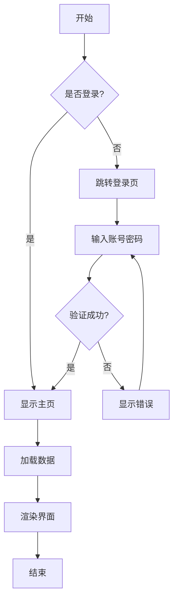
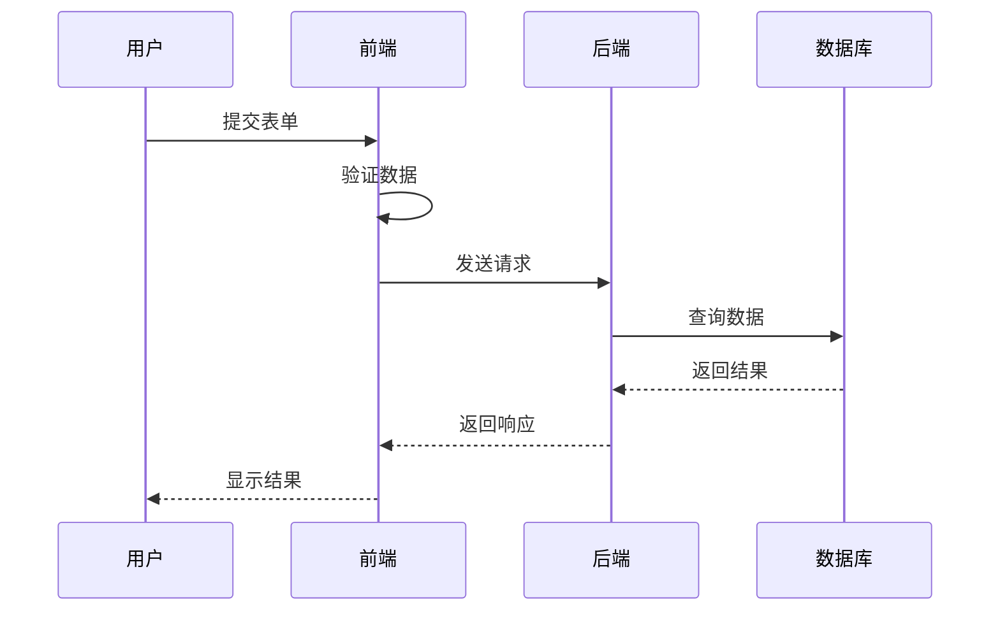
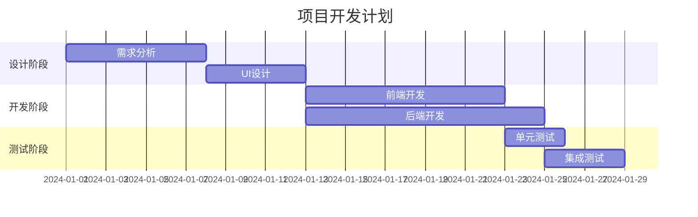
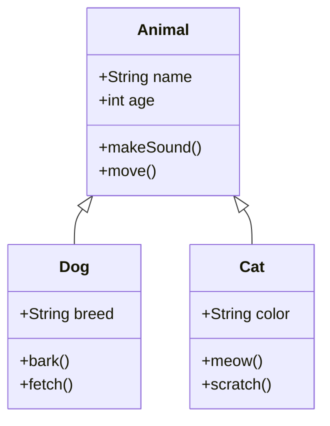

# 工具使用说明文档

这是一个完整的 Markdown 功能测试文档，展示各种格式和特性。

## 基本文本格式

这是一段普通文本，支持**粗体**、*斜体*、~~删除线~~和`行内代码`。

### 列表功能

#### 无序列表
- 第一项
- 第二项
  - 嵌套项 2.1
  - 嵌套项 2.2
- 第三项

#### 有序列表
1. 首先做这个
2. 然后做那个
3. 最后完成

## 代码示例

### JavaScript 代码
```javascript
// 这是一个 JavaScript 示例
function greet(name) {
  console.log(`Hello, ${name}!`);
  return `Welcome to ${name}'s world`;
}

const user = {
  name: 'Alice',
  age: 25,
  hobbies: ['reading', 'coding', 'gaming']
};

greet(user.name);
```

### Python 代码
```python
# Python 代码示例
def calculate_fibonacci(n):
    """计算斐波那契数列"""
    if n <= 1:
        return n
    return calculate_fibonacci(n-1) + calculate_fibonacci(n-2)

# 使用列表推导式
squares = [x**2 for x in range(10)]
print(f"前10个平方数: {squares}")
```

### Shell 脚本
```bash
#!/bin/bash
# 批量处理文件
for file in *.txt; do
    echo "Processing: $file"
    cat "$file" | grep "error" >> errors.log
done
```

## 引用块

> 这是一个引用块。
> 
> 可以包含多行内容，用于强调重要信息或引用他人的话。
> 
> **注意**：引用块可以包含其他 Markdown 格式。

## 表格

| 功能 | 支持程度 | 说明 |
|------|---------|------|
| 代码高亮 | ✅ 完全支持 | 支持多种编程语言 |
| Mermaid 图表 | ✅ 完全支持 | 流程图、时序图等 |
| 图片显示 | ✅ 完全支持 | 支持本地和远程图片 |
| 视频播放 | ✅ 完全支持 | 支持常见视频格式 |
| 数学公式 | ⚠️ 部分支持 | 需要额外配置 |

## 流程图示例

### 简单流程图


### 时序图


### 甘特图


### 类图


## 链接和图片

### 链接
- [GitHub](https://github.com)
- [MDN Web Docs](https://developer.mozilla.org)

### 图片


## 分隔线

---

## 任务列表

- [x] 完成 Markdown 渲染
- [x] 添加代码高亮
- [x] 支持 Mermaid 图表
- [ ] 添加数学公式支持
- [ ] 支持自定义主题

## 高级功能

### 嵌套引用
> 第一层引用
> > 第二层引用
> > > 第三层引用

### 混合列表
1. 第一项
   - 子项 A
   - 子项 B
2. 第二项
   ```javascript
   // 列表中的代码块
   const item = { id: 2, name: 'Item 2' };
   ```
3. 第三项

## 注意事项

⚠️ **重要提示**：
- 确保所有依赖已正确安装
- Mermaid 图表需要一定的加载时间
- 大型图表可能影响页面性能

✨ **最佳实践**：
- 使用语义化的标题层级
- 代码块指定正确的语言
- 图片添加合适的 alt 文本

---

*文档最后更新时间：2024-12-19*
